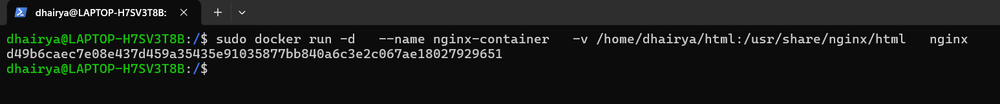
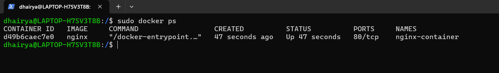
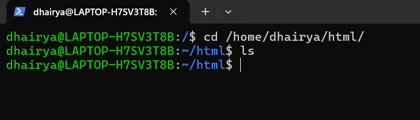
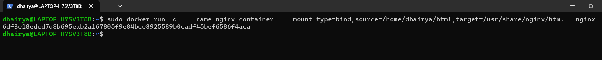
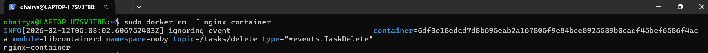
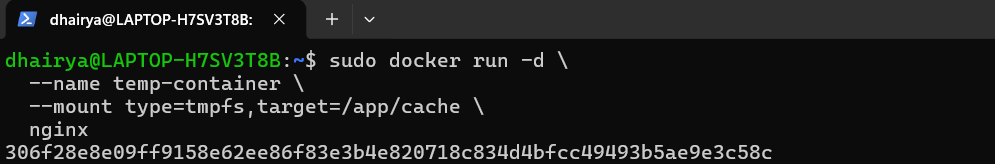
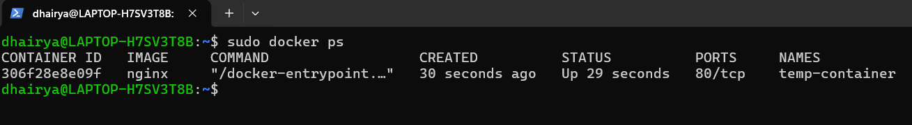

<h2 align='center'>Data Management in Docker with <b>bind mount<b> & <b>tempfs<b></h2>

<hr>

#### Introduction
Bind mount maps a **host directory directly** into a container.
Host controls data.


#### Procedure

<hr>

<h6 align='center'>Bind Mount</h6>

<hr>


**Step-1:- Run a container with system folder as volume**
```bash
docker run -d \
  --name nginx-container \
  -v /home/dhairya/html:/usr/share/nginx/html \
  nginx
```



**Step-2:- Verify Container**
```bash
docker ps
```



**Step-3:- Verify Folder on Host Machine**
```bash
cd /home/dhairya/html
```



**Step-4:- Run Container via Mount**
```bash
docker run -d \
  --name nginx-container \
  --mount type=bind,source=/home/dhairya/html,target=/usr/share/nginx/html \
  nginx

```



**Step-5:- Remove Container**
```bash
docker rm -f nginx-container
```


<>

<hr>

<h6 align='center'>tempfs</h6>

<hr>


**Step-6:- Create a tempfs Mount**
```bash
docker run -d \
  --name temp-container \
  --mount type=tmpfs,target=/app/cache \
  nginx
```



**Step-7:- Verify Container**
```bash
docker ps
```


<hr>

#### Comparison: Volume vs Bind Mount vs tmpfs

| Feature         | Volume           | Bind Mount    | tmpfs     |
| --------------- | ---------------- | ------------- | --------- |
| Managed by      | Docker           | Host OS       | Memory    |
| Location        | Docker directory | Any host path | RAM       |
| Persistence     | Yes              | Yes           | No        |
| Performance     | Good             | Good          | Very Fast |
| Production safe | Yes              | Risky         | Limited   |
| Dev friendly    | Moderate         | Excellent     | No        |

---
