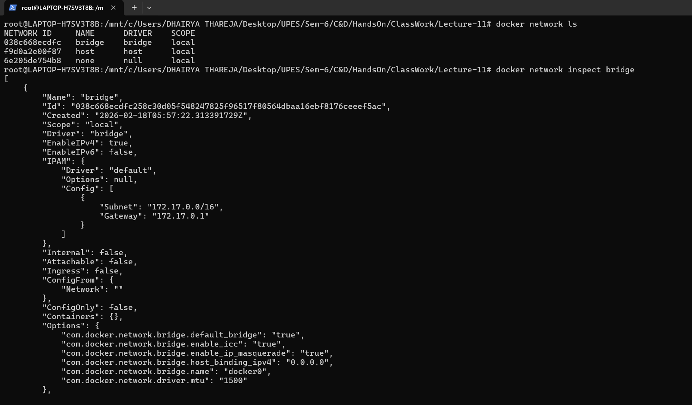
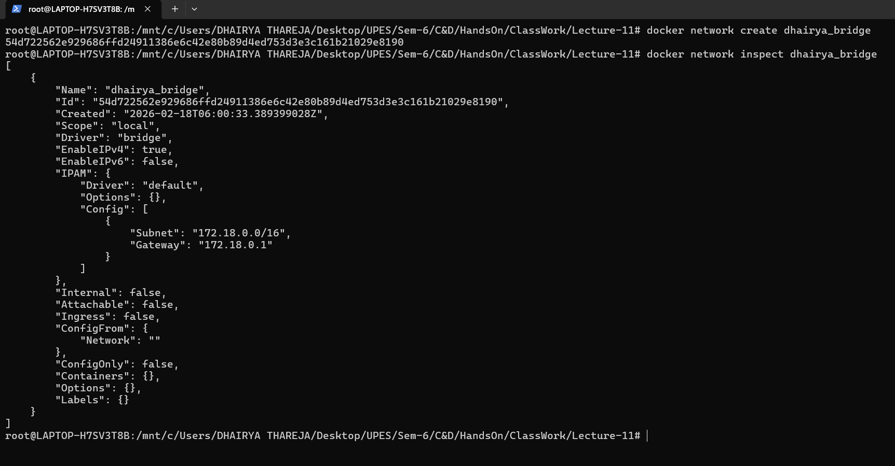
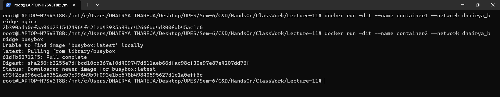
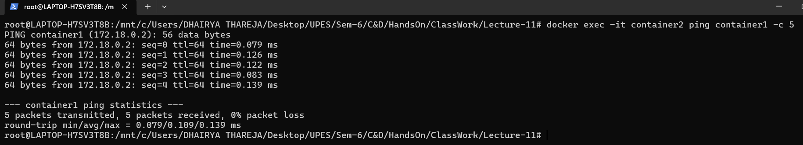
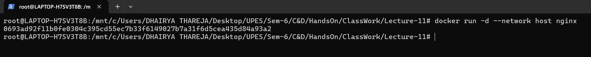
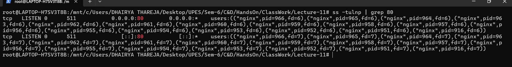
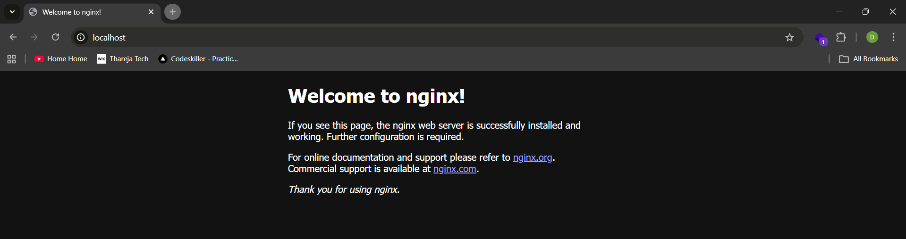

<h2 align='center'> Docker Networking – Complete Guide </h2>

<hr>

<h4 align='center'> Introduction </h4>

<hr>


###### 1. What is Docker Networking?

When you run a container, it runs in an isolated environment. Think of it like an apartment:
- Each apartment (container) has its own address (IP)
- Apartments need ways to talk to each other (hallways)
- They need ways to get mail from outside (internet access)
- They need doors (ports) to receive visitors

**Docker networking solves:**
- Container ↔ Container communication
- Container ↔ Host machine communication  
- Container ↔ Internet communication
- Containers on different servers talking to each other


###### 2. Docker Network Drivers (The Basics)

Docker provides different types of networks (drivers) for different needs:

| Driver | Simple Analogy | When to Use |
|--------|---------------|-------------|
| **bridge** | Apartment building with shared hallway | Default for single host, most common |
| **host** | Living in same room as host | Need max performance, no isolation needed |
| **overlay** | Underground tunnel connecting buildings | Multiple servers need to talk |
| **macvlan** | Separate house with own mailbox | Need real network IP |
| **none** | Isolated room with no doors | Complete isolation needed |


###### 3. Bridge Network (The Default)

**What is Bridge?**

When you install Docker, it creates a default bridge network called `docker0`. Think of it as a virtual switch inside your computer.


<hr>

<h4 align='center'> HandOn Procedure </h4>

<hr>

**Step-1:- List & Inspect Docker Network**
```bash
docker network ls
docker network inspect bridge
```



**Step-2: Create Your Own Bridge (Better than default)**
```bash
docker network create dhairya_bridge
docker network ls
docker network inspect dhairya_bridge
```


_Why custom bridge ?_ 
It gives you automatic DNS (containers can find each other by name).

**Step-3: Run Containers in Your Network**
```bash
docker run -dit --name container1 --network dhairya_bridge nginx

docker run -dit --name container2 --network dhairya_bridge busybox
```



**Step-4: Ping Container**
```bash
docker exec -it container2 ping container1 -c 5
```


_-c => stands for number of packets_


**Bridge Network Cheat Sheet**
```bash
# List networks
docker network ls

# Create network
docker network create mynet

# Run container in network
docker run -d --network mynet --name myapp nginx

# Connect running container to network
docker network connect mynet mycontainer

# Disconnect container
docker network disconnect mynet mycontainer

# Remove network
docker network rm mynet
```


###### 4. Host Network

### What is Host Network?

Container shares your computer's network directly – no separation, no private IP.

**Step-1: Run container with Host Network**
```bash
docker run -d --network host  nginx
```



**Step-2: Verify nginx**
```bash
ss -tulnp | grep 80
```



**Step-2: Verify nginx on browser**
```bash
ss -tulnp | grep 80
```



**When to use:**
- Need maximum performance
- Application needs to monitor host network
- Short-term testing

**When NOT to use:**
- Need isolation (containers can conflict with host apps)
- On Docker Desktop (limited support)
- Running multiple containers needing same ports

