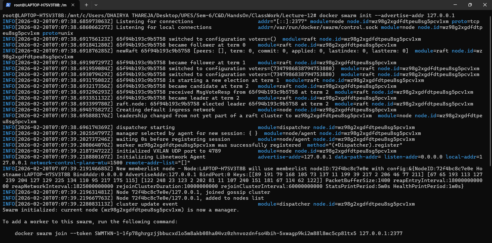
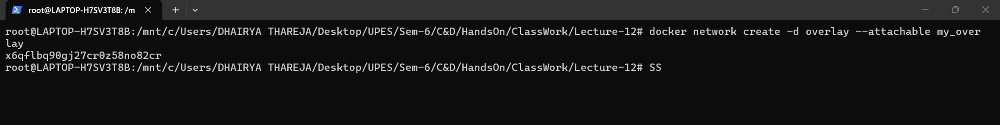
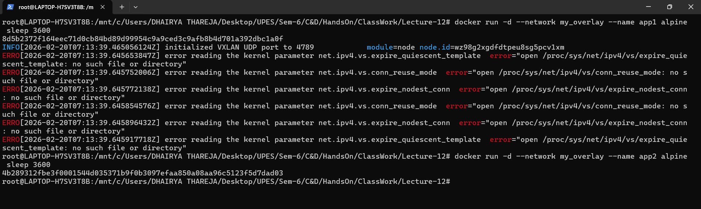
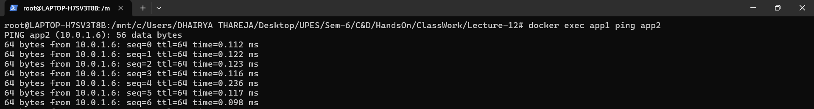
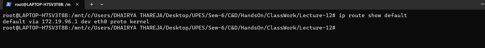
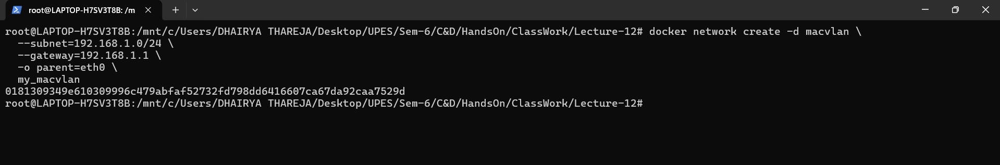
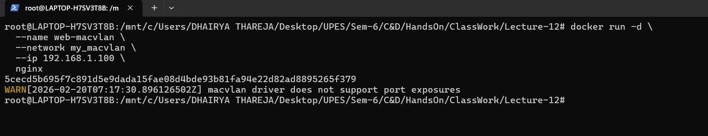

<h2 align='center'> Overlay Networks (Multi-Host) </h2>

<hr>

<h4 align='center'> Introduction </h4>

<hr>


##### What is Overlay?

When you have multiple servers (hosts) running Docker, containers need to talk across hosts. Overlay networks create a virtual network that spans all hosts.

**Analogy:** Imagine tunnels connecting buildings – containers in different buildings can talk as if they're next door.

_Prerequisites for Overlay_

1. **Docker Swarm mode enabled** (Docker's clustering solution)
2. **Ports open** between hosts:
   - 2377/tcp: Swarm management
   - 7946/tcp/udp: Node communication
   - 4789/udp: Overlay network traffic


<hr>

<h4 align='center'> HandOn Procedure - Single-Machine Overlay </h4>

<hr>

**Step-1:- Initialize Swarm**
```bash
docker swarm init --advertise-addr 127.0.0.1
```



**Step-2: Create overlay network**
```bash
docker network create -d overlay --attachable my_overlay
```



**Step-3: Run containers (they'll all be on same machine)**
```bash
docker run -d --network my_overlay --name app1 alpine sleep 3600
docker run -d --network my_overlay --name app2 alpine sleep 3600
```



**Step-4: Test communication**
```bash
docker exec app1 ping app2
```



<hr>

##### MACVLAN Network

<hr>

##### What is MACVLAN?

Each container gets:
- A real MAC address (like a physical network card)
- A real IP from your physical network
- Appears as a separate device on your LAN

**Analogy:** Instead of apartments sharing a mailbox (NAT), each container has its own house with its own mailbox.

**When to Use MACVLAN**

**Good for:**
- Legacy apps that expect direct network access
- Network monitoring tools
- Apps that don't work well with NAT
- When you need containers to have real LAN IPs

**Not good for:**
- Laptops on WiFi (usually doesn't work)
- When host needs to talk to container (complex)
- Networks that limit MAC addresses per port


<hr>

<h4 align='center'> HandOn Procedure - MACVLAN </h4>

<hr>

**Step-1: Find your network details**
```bash
ip route show default
```



**Step-2: Create MACVLAN network**
```bash
docker network create -d macvlan \
  --subnet=192.168.1.0/24 \
  --gateway=192.168.1.1 \
  -o parent=eth0 \
  my_macvlan
```



**Step-3: Run container with specific IP**
```bash
docker run -d \
  --name web-macvlan \
  --network my_macvlan \
  --ip 192.168.1.100 \
  nginx
```

