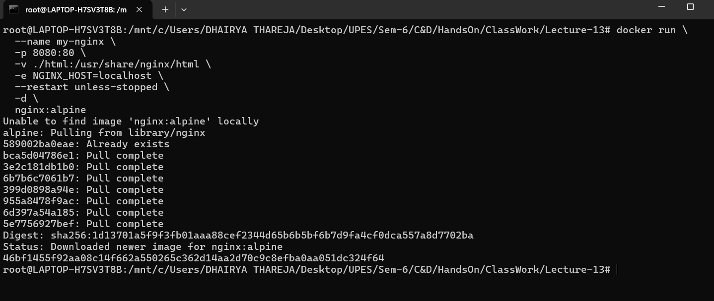
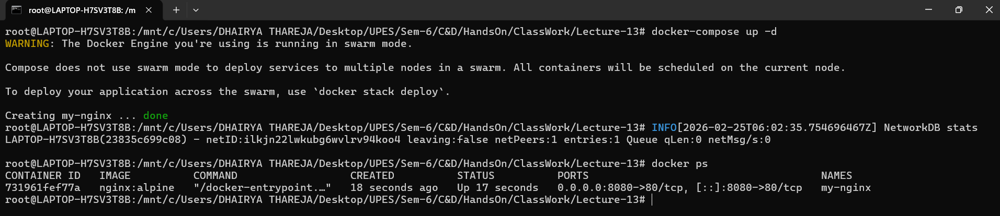
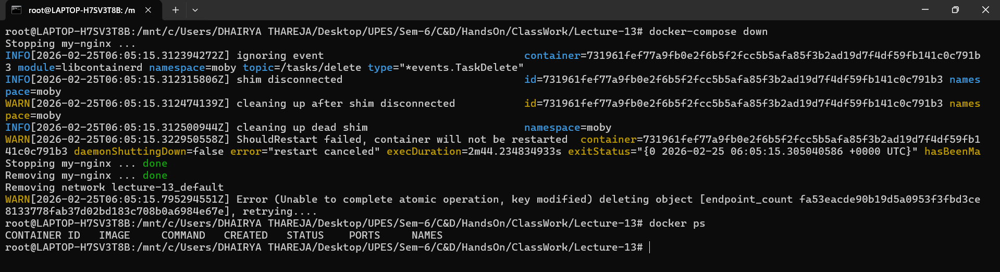
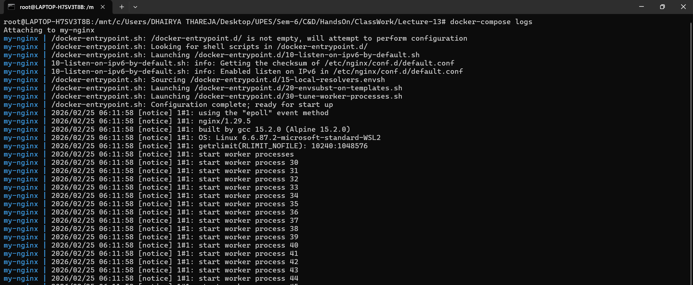
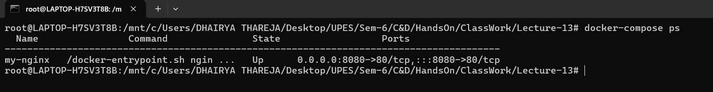

<h2 align='center'> Docker-Compose vs Docker-Run </h2>


<hr>

<h4 align='center'> Introduction </h4>

<hr>

**Docker Compose** is essentially a YAML-based wrapper around multiple `docker run` commands. It translates your compose file into individual Docker commands behind the scenes. Let's see how each `docker run` flag maps to Docker Compose.


<hr>

<h4 align='center'> HandsOn </h4>

<hr>


**Step-1:- unning Nginx with Docker Run**
```bash
docker run \
  --name my-nginx \
  -p 8080:80 \
  -v ./html:/usr/share/nginx/html \
  -e NGINX_HOST=localhost \
  --restart unless-stopped \
  -d \
  nginx:alpine
```



**Step-2:- Same Setup with Docker Compose:**

**`docker-compose.yml`**
```yaml
version: '3.8'
services:
  nginx:
    image: nginx:alpine          # Image name (same as in docker run)
    container_name: my-nginx     # --name my-nginx
    ports:
      - "8080:80"               # -p 8080:80
    volumes:
      - ./html:/usr/share/nginx/html  # -v ./html:/usr/share/nginx/html
    environment:
      - NGINX_HOST=localhost    # -e NGINX_HOST=localhost
    restart: unless-stopped     # --restart unless-stopped
```

**Note:** \
-d flag in docker run = detached mode \
In docker-compose, use: docker-compose up -d


**Step-3:- Create container from Compose**
```bash
docker-compose up -d
```



**Step-3:- Down Container via Compose**
```bash
docker-compose down
```


**Note:-** \
Down delets the container but not the associated volume.


**Step-4:- List the docker-compose logs**
```bash
docker-compose logs
```



**Step-5:- Check Status in docker-compose**
```bash
docker-compose ps
```



<hr>


#### Key Advantages of Docker Compose

**1. Simplicity for Multi-Container Apps**
```bash
# Instead of 5+ docker run commands...
# Just one command:
docker-compose up -d
```

**2. Reproducibility**
- Same configuration everywhere
- No forgotten flags
- Consistent environments

**3. Declarative Configuration**
- Define WHAT you want, not HOW to run it
- Self-documenting
- Easy to modify

**4. Lifecycle Management**
```bash
# Easy to manage entire application
docker-compose up    # Start
docker-compose down  # Stop & clean
docker-compose logs  # View logs
docker-compose ps    # Check status
```

#### Quick Reference Cheatsheet

| Docker Run Flag | Docker Compose Equivalent |
|----------------|---------------------------|
| `-p 80:80` | `ports: ["80:80"]` |
| `-v ./data:/app` | `volumes: ["./data:/app"]` |
| `-e KEY=value` | `environment: [KEY=value]` |
| `--name myapp` | `container_name: myapp` |
| `--network net` | `networks: [net]` |
| `--restart always` | `restart: always` |
| `-d` | `docker-compose up -d` |
| `--link container` | `depends_on: [container]` |
| `-w /app` | `working_dir: /app` |
| `--user 1000` | `user: "1000"` |


<hr>


<h4 align='center'> Conclusion </h4>

<hr>


**Docker Compose** is essentially a YAML-based abstraction layer over multiple `docker run` commands. It:

1. **Translates directly**: Every Compose option has a corresponding `docker run` flag
2. **Simplifies complex setups**: Instead of remembering multiple commands, you define everything in one file
3. **Manages relationships**: Handles dependencies between containers automatically
4. **Provides consistency**: Ensures the same configuration is used every time

Think of it this way:
- `docker run` = Imperative approach ("Do these steps")
- `docker-compose` = Declarative approach ("Here's what I want")

_This makes Docker Compose especially valuable for development environments and multi-service applications where you need to coordinate several containers working together._


