<h2 align='center'> Deploy Web Application via Kubernetes </h2>


<hr>

<h4 align='center'> Hands 0n  </h4>

<hr>

**Step-1:- Run a Pod**
```bash
kubectl run apache-pod --image=httpd
```
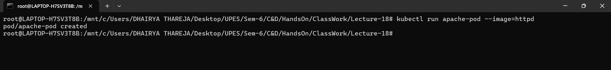


**Step-2:- List Pods**
```bash
kubectl get pods
```
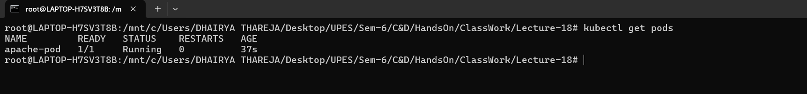


**Step-3:- Inspect Pod**
```bash
kubectl describe pod apache-pod
```
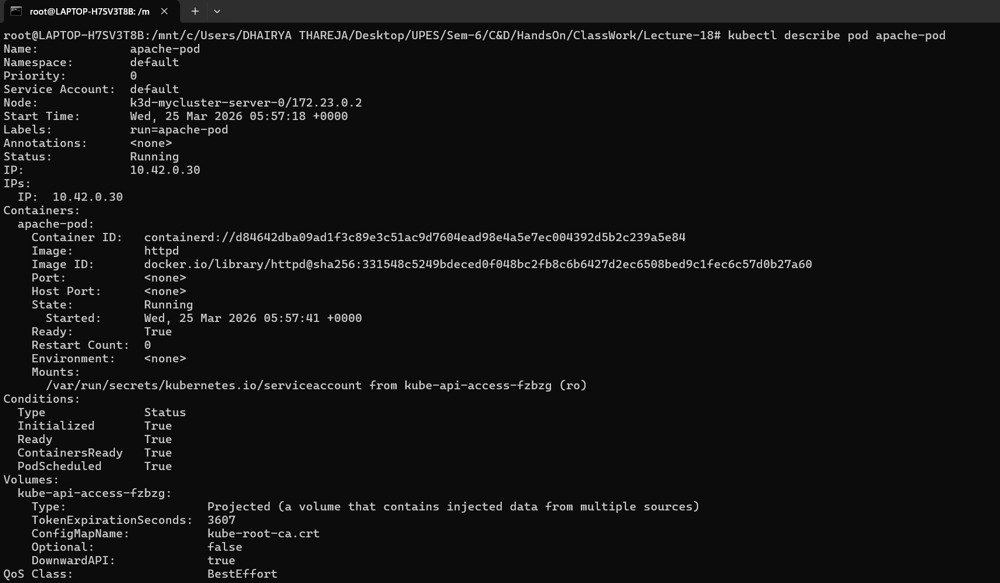


**Step-4:- Access the App**
```bash
kubectl port-forward pod/apache-pod 8081:80
```
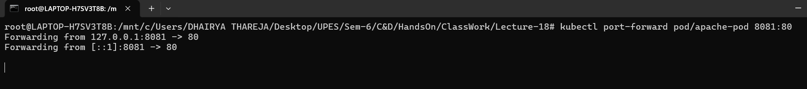


**Step-5:- Verify**
```
http://localhost:8081
```
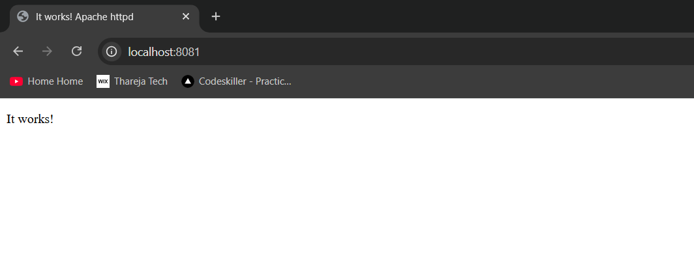

You should see:
→ Apache default page (“It works!”)


**Step-6:- Delete Pod**
```bash
kubectl delete pod apache-pod
```
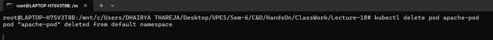

_Insight:_
Same as before:
* Pod disappears permanently
* No self-healing


**Step-7:- Create Deployment**
```bash
kubectl create deployment apache --image=httpd
```
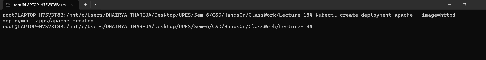


**Step-8:- Check**
```bash
kubectl get deployments
kubectl get pods
```
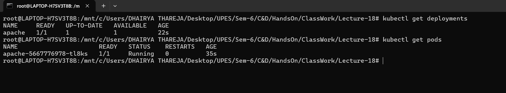


**Step-9:- Expose Deployment**
```bash
kubectl expose deployment apache --port=80 --type=NodePort
```
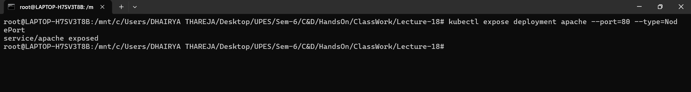


**Step-10:- Access again**
```bash
kubectl port-forward service/apache 8082:80
```
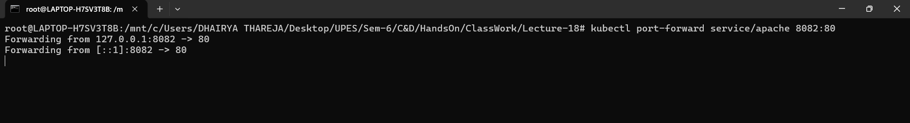


**Step-11:- Verify**
```
http://localhost:8082
```
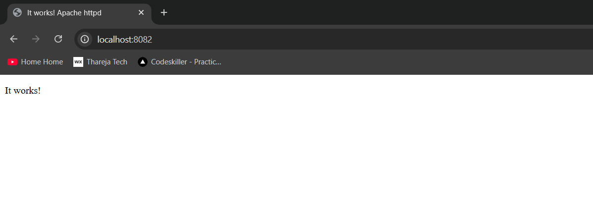


**Step-12:- Scale Deployment**
```bash
kubectl scale deployment apache --replicas=2
```
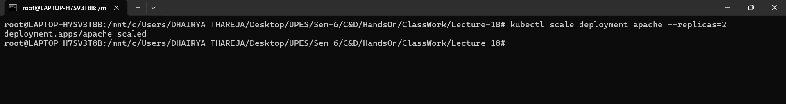


**Step-13:- List Pods**
```bash
kubectl get pods
```
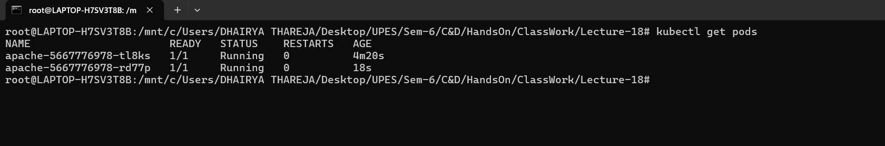


**Step-14:- Break the App**
```bash
kubectl set image deployment/apache httpd=wrongimage
```
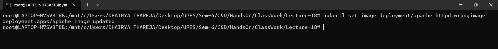


**Step-15:- List Pods**
```bash
kubectl get pods
```
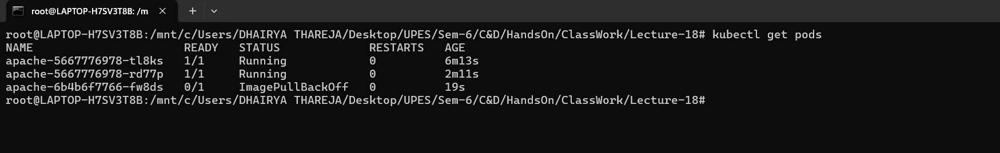


**Step-16:- Diagnose**
```bash
kubectl describe pod <pod-name>
```
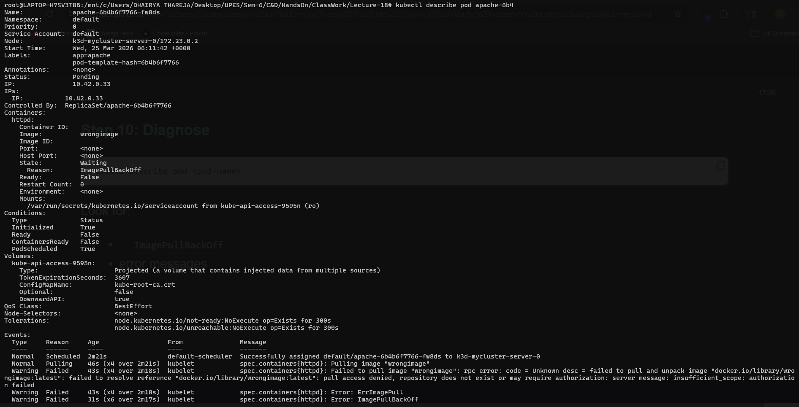

_Look for:_
* `ImagePullBackOff`
* error messages


**Step-17:- Fix It**
```bash
kubectl set image deployment/apache httpd=httpd
```
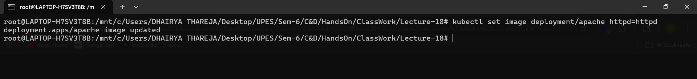


**Step-18:- Exec into Pod**
```bash
kubectl exec -it <pod-name> -- /bin/bash
```
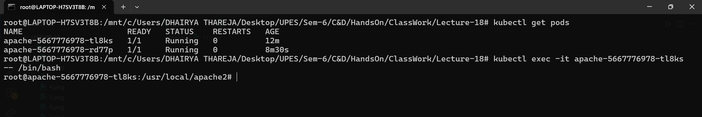


**Step-19:- Now inside container:**
```bash
ls /usr/local/apache2/htdocs
```
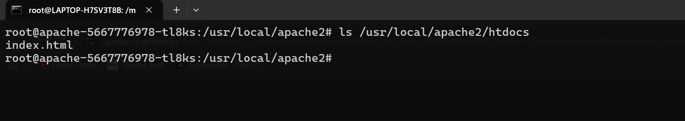

_This is where web files are stored._


**Step-20:- Exit**
```bash
exit
```
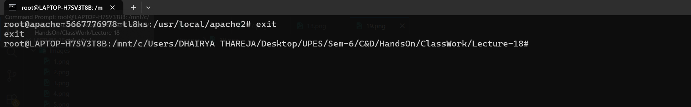


**Step-21:- Delete One Pod**
```bash
kubectl delete pod <one-pod-name>
```
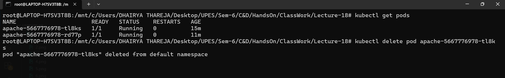


**Step-22:- Watch**
```bash
kubectl get pods -w
```
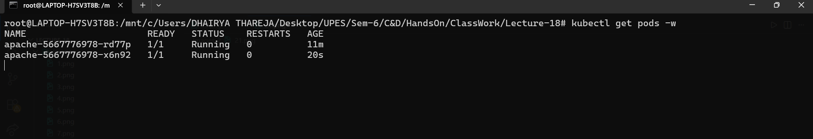


**Step-23:- Cleanup**
```bash
kubectl delete deployment apache
kubectl delete service apache
```
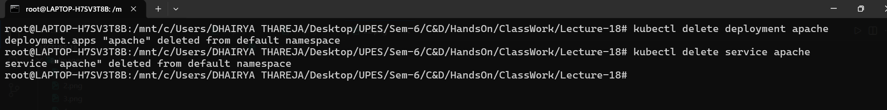


<hr>

<h4 align='center'> Insights  </h4>

<hr>

**Why there is no detached mode**

`kubectl port-forward` is meant as a **temporary debugging tool**, not a background service.

Kubernetes expects:

* Short-lived usage
* Manual control (start → debug → stop)

For long-running exposure, Kubernetes provides proper resources:

* `Service` (NodePort / ClusterIP)
* `Ingress`


**Running in background using `&`**
```bash
kubectl port-forward pod/apache-pod 8081:80 &
```

This sends the process to the background.


**How to identify the process**

>Method 1: Using jobs (current terminal)
```
jobs
```

_Output example:_
```
[1]+  Running   kubectl port-forward pod/apache-pod 8081:80 &
```


**Method 2: Using `ps`**
```bash
ps aux | grep port-forward
```

_Example output:_
```bash
user   12345  ... kubectl port-forward pod/apache-pod 8081:80
```

> Here, `12345` is the **PID (Process ID)**


**How to stop the process**

**Method 1: Using job number**
```
kill %1
```


**Method 2: Using PID**
```
kill 12345
```

**Method 3: Kill all port-forward processes**
```bash
pkill -f port-forward
```


**Better approach (recommended)**
Instead of `&`, use:

**Option 1: `tmux`**
```bash
tmux new -s pf
kubectl port-forward pod/apache-pod 8081:80
```

_Detach:_
```
Ctrl + b, d
```

This is cleaner and easier to manage.


**Option 2: `nohup`**
```bash
nohup kubectl port-forward pod/apache-pod 8081:80 > pf.log 2>&1 &
```


<hr>

<h4 align='center'> Summary  </h4>

<hr>

* `kubectl port-forward` blocks terminal because it runs a **live network tunnel**
* No detached mode because it is meant for **temporary debugging**
* Use `&`, `jobs`, `ps`, and `kill` to manage background processes
* Prefer `tmux` for better control in DevOps workflows

