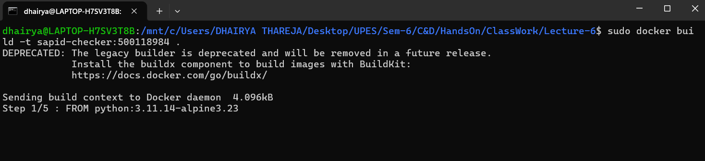
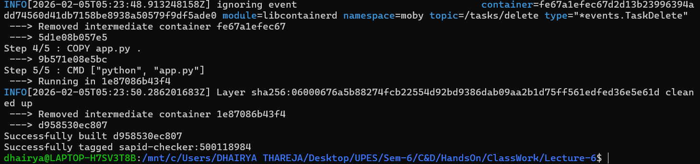
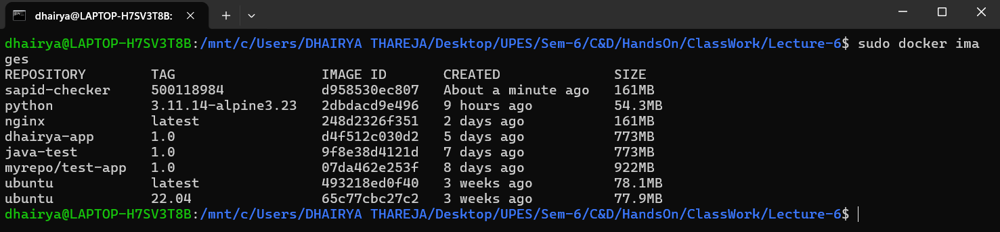
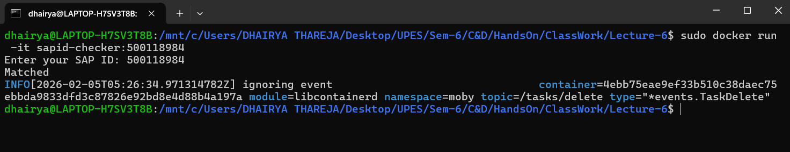
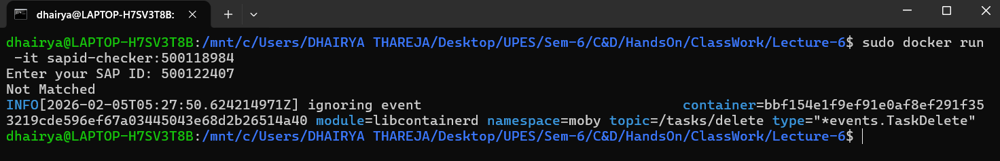

<h2 align="center"> Class Test </h2>

<hr>

---

#### Problem Statement

You are given a simple Python program that:

1. Takes a **SAP ID** as input
2. Compares it with a **stored SAP ID**
3. Prints:

   * `Matched` if both SAP IDs are same
   * `Not Matched` otherwise

You must **containerize this application** using Docker.

---


---

#### Solution

**Step-1:- Create a python file with following code.**

```python
import numpy as np  

stored_sapid = "500118984"
user_sapid = input("Enter your SAP ID: ")

if user_sapid == stored_sapid:
    print("Matched")
else:
    print("Not Matched")
```


**Step-2:- Create a Dockerfile with following code.**

```bash
FROM python:3.11.14-alpine3.23
WORKDIR /home/app
RUN pip install numpy
COPY app.py .
CMD ["python", "app.py"]
```


**Step-3:- Build Docker Image from the DockerFile**

```bash
docker build -t sapid-checker:<YOUR_SAPID> .
```





**Step-4:- Verify Image in the list.**

```bash
docker build images
```




**Step-5:- Run containers from image for verification**

```bash
docker run -it sapid-checker:<YOUR_SAPID>
```



<hr>
---

