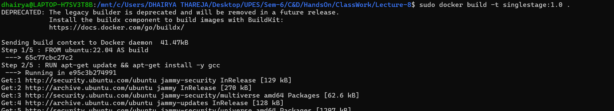
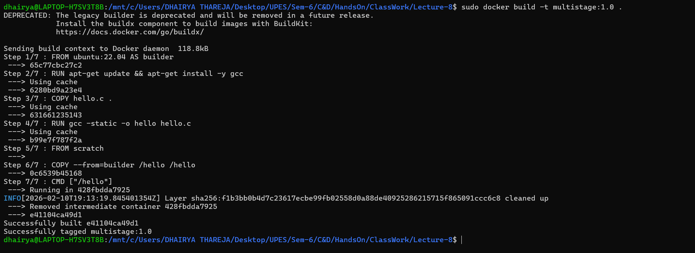
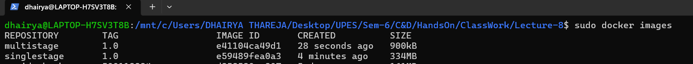
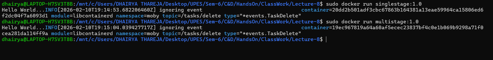

<h2 align='center'>SingleStage Vs MultiStage</h2>

<hr>

#### Introduction 
In this Lecture, we are going to learn the difference between Single-Stage and Multi-Stage docker file and compare which is better for our usecase based on performance and size. 


#### Procedure
**Step-1:-  Create a Single-Stage Dockerfile as follows:**

```bash
FROM ubuntu:22.04 AS build
RUN apt-get update && apt-get install -y gcc
COPY hello.c .
RUN gcc -static -o hello hello.c


CMD ["./hello"]
```

**Step-2:- Build an image from the Single-Stage Dockerfile.**

```bash
docker build -t singlestage:1.0 .
```



**Step-3:- Verify Image Build via following command**

```bash
docker images
```


**Step-4:-  Create a Multi-Stage Dockerfile as follows:**

```bash
# Stage 1: Build
FROM ubuntu:22.04 AS builder
RUN apt-get update && apt-get install -y gcc
COPY hello.c .
RUN gcc -static -o hello hello.c

# Stage 2: Runtime (FROM scratch = minimal)
FROM scratch
COPY --from=builder /hello /hello
CMD ["/hello"]

```

**Step-5:- Build an image from the Multi-Stage Dockerfile.**

```bash
docker build -t multistage:1.0 .
```



**Step-6:- Verify Image Build via following command**

```bash
docker images
```



**Step-7:- Run Container from the Images to verify functionality**

```bash
docker run <container_name>:<container_tag>
```


