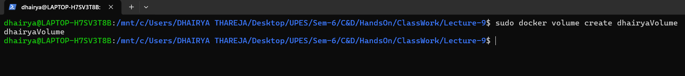
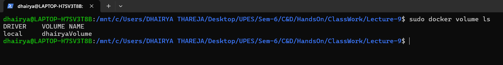
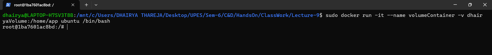
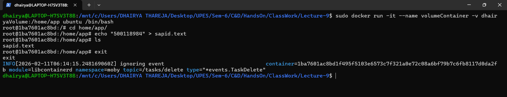
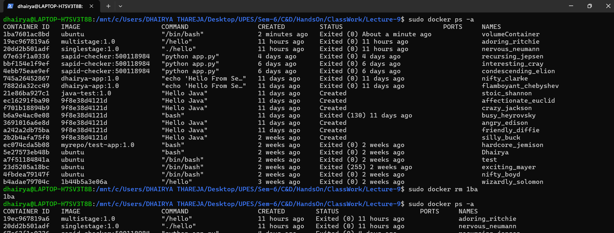
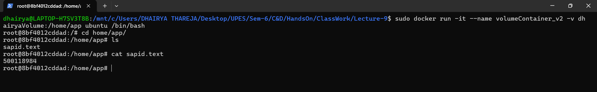
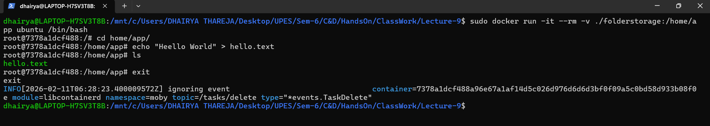
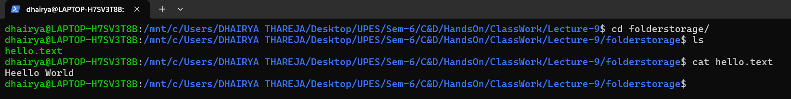

<h2 align='center'>Data Management in Docker with <b>volume<b>, <b>bind mount<b> and <b>tempfs<b></h2>

#### Introduction
Containers are ephemeral.
Data stored inside container filesystem is deleted when the container is removed. \\
A **volume** is a Docker-managed storage location stored under:
```
/var/lib/docker/volumes/
```
Docker controls its lifecycle.


#### Procedure

<hr>

<h6 align='center'>Volume</h6>

<hr>


**Step-1:- Create a Volume**
```bash
docker volume create dhairyaVolume
```



**Step-2:- Verify Volume**
```bash
docker volume ls
```



**Step-3:- Run a container and embed a custom volume inside it**
```bash
docker run -it volumeContainer -v dhairyaVolume:/home/app ubuntu /bin/bash
```



**Step-4:- Save a file inside the volume**
```bash
cd /home/app
echo "message" > file.txt
ls
```



**Step-5:- Delete Container**
```bash
docker ps -a
docker rm <container_id>
docker ps -a
```



**Step-6:- Run another container(v2) and embed a existing volume inside it & Verify data exist or not**
```bash
docker run -it volumeContainer_v2 -v dhairyaVolume:/home/app ubuntu /bin/bash
cd /home/app
ls
cat file.txt
```



<hr>

<h6 align='center'>Folder as Storage</h6>

<hr>


**Step-7:- Run a container with folder as a storage**
```bash
docker run -it --rm -v ./folderstorage:/home/app ubuntu /bin/bash
cd /home/app
echo "message" > file.txt
ls
```



**Step-8:- Verify file in Folder Storage**
```bash
cd folderstorage/
ls
cat hello.txt
```

