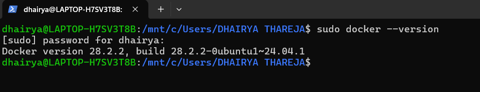
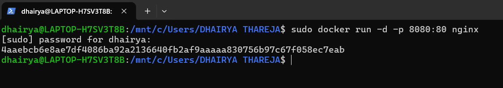

## Experiment 2:- Docker Installation, Configuration, and Running Images

**Step 1: Check Docker Version**

```bash
docker --version
```



**Step 2: Run Container with Port Mapping**

```bash
docker run -d -p 8080:80 nginx
```



**Step 3: Verify Running Containers**

```bash
docker ps
```


**Step 4: Stop Container**

```bash
docker stop <container_id>
```


**Step 5: Remove Container**

```bash
docker rm <container_id>
```


**Step 5: Remove Image**

```bash
docker rmi nginx
```


**Result**
Docker images were successfully pulled, containers executed, and lifecycle commands performed.


<hr>


<div align="center">

<a href="../Experiment-1/" class="btn btn-outline">⬅️ Previous</a>
&nbsp;&nbsp;
<a href="../" class="btn">🏠︎ Home</a>
&nbsp;&nbsp;
<a href="../Experiment-3/" class="btn btn-primary">Next ➡️</a>

</div>


