## Experiment 4: Docker Essentials

##### `Dockerfile` `.dockerignore` `tagging` `publishing` 

<hr>

<h4 align="center"> Containerizing Applications with Dockerfile </h4>

<hr>

**Step-1: Create a Directory for Python application**
```bash
mkdir my-flask-app
cd my-flask-app
```
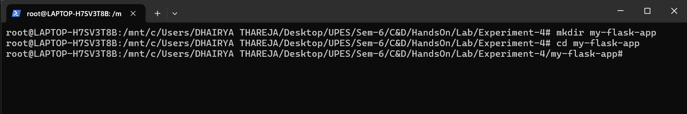

**Step-2:- Create an **`app.py`:****
```python
from flask import Flask
app = Flask(__name__)

@app.route('/')
def hello():
    return "Hello from Docker!"

@app.route('/health')
def health():
    return "OK"

if __name__ == '__main__':
    app.run(host='0.0.0.0', port=5000)
```
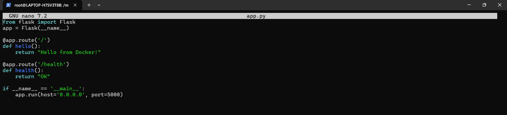

**Step-3:- Create **`requirements.txt`:****
```
Flask==2.3.3
```
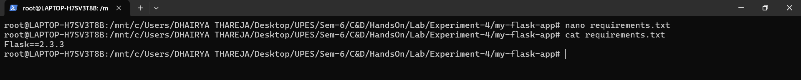


**Step-4: Create **Dockerfile****
```dockerfile
# Use Python base image
FROM python:3.9-slim

# Set working directory
WORKDIR /app

# Copy requirements file
COPY requirements.txt .

# Install dependencies
RUN pip install --no-cache-dir -r requirements.txt

# Copy application code
COPY app.py .

# Expose port
EXPOSE 5000

# Run the application
CMD ["python", "app.py"]
```
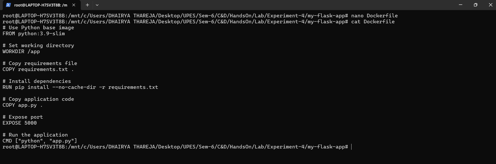


**Step-5:- Create a **`.dockerignore`:****
```
# Python files
__pycache__/
*.pyc
*.pyo
*.pyd

# Environment files
.env
.venv
env/
venv/

# IDE files
.vscode/
.idea/

# Git files
.git/
.gitignore

# OS files
.DS_Store
Thumbs.db

# Logs
*.log
logs/

# Test files
tests/
test_*.py
```
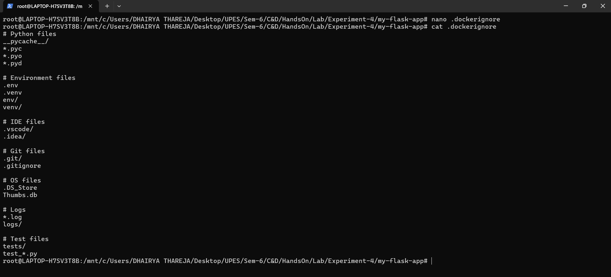


_Why **`.dockerignore`** is Important_
- Prevents unnecessary files from being copied
- Reduces image size
- Improves build speed
- Increases security


**Step-6: Build image from Dockerfile**
```bash
docker build -t my-flask-app .
```
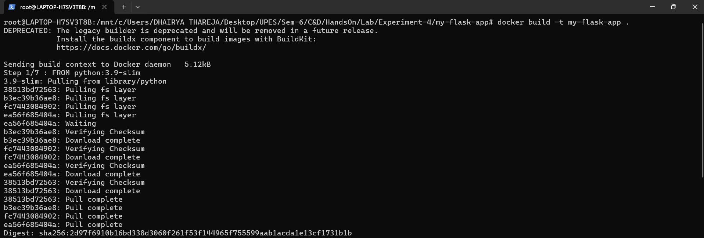

**Step-7:- Verify Image**
```bash
docker images
```
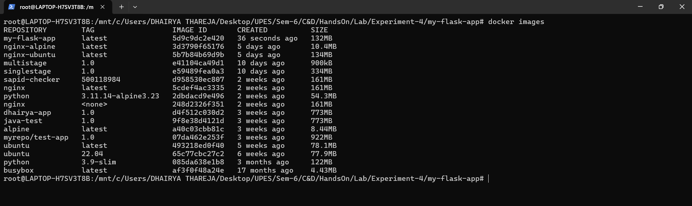


**Step-8: Add Tag in Image**
```bash
docker build -t my-flask-app:1.0 .
```
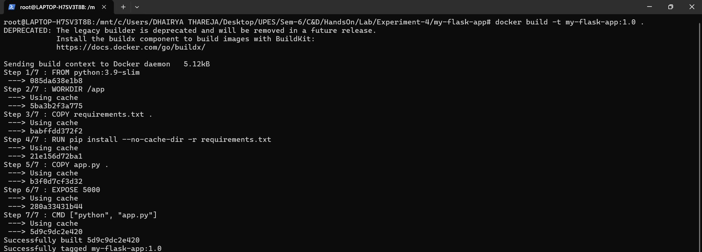


**Step-9:- Add multiple tags**
```bash
docker build -t my-flask-app:latest -t my-flask-app:1.0 .
```
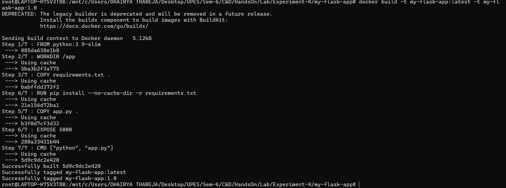


**Step-10:- Add Tag with custom registry**
```bash
docker build -t username/my-flask-app:1.0 .
```
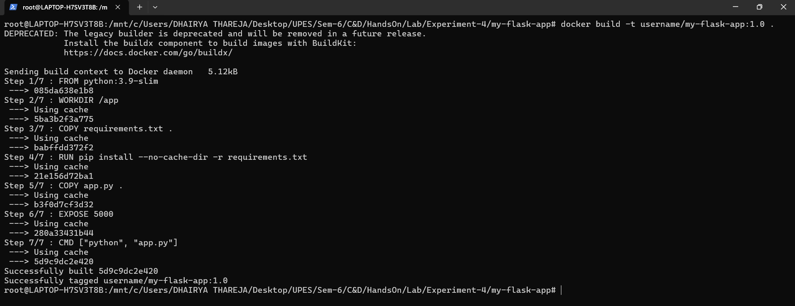


**Step-11:- Tag existing image**
```bash
docker tag my-flask-app:latest my-flask-app:v1.0
```
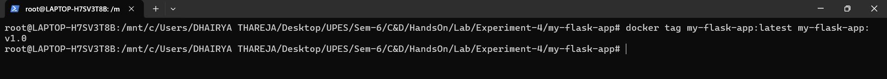


**Step-12: View Image Details**
```bash
docker images
```
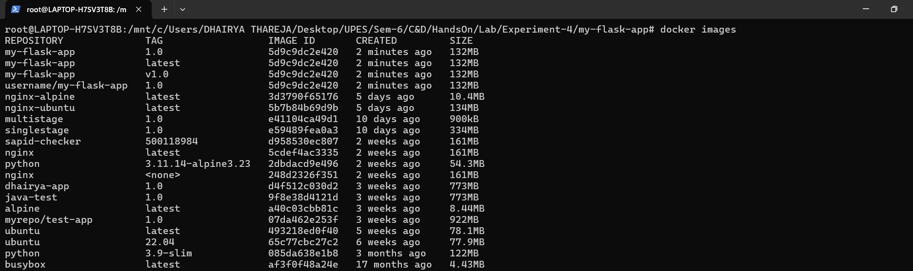


**Step-13:- Show image history**
```bash
docker history my-flask-app
```
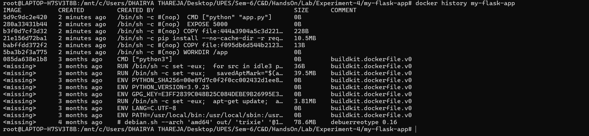


**Step-14:- Inspect image details**
```bash
docker inspect my-flask-app
```
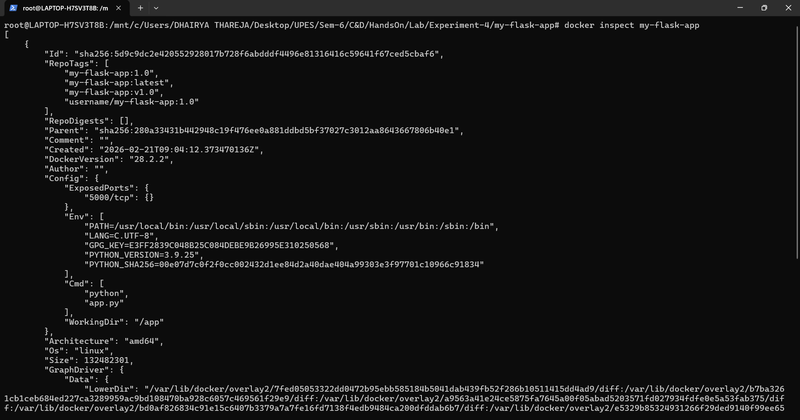


**Step-15: Run Container**
```bash
docker run -d -p 5000:5000 --name flask-container my-flask-app
```
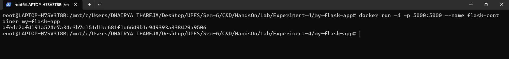


**Step-16:- Test the application**
```bash
curl http://localhost:5000
```
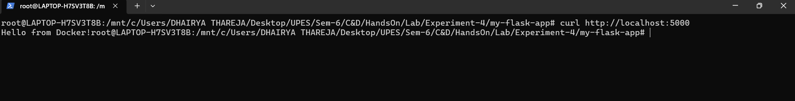


**Step-17:- View running containers**
```bash
docker ps
```
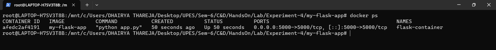


**Step-18:- View container logs**
```bash
docker logs flask-container
```
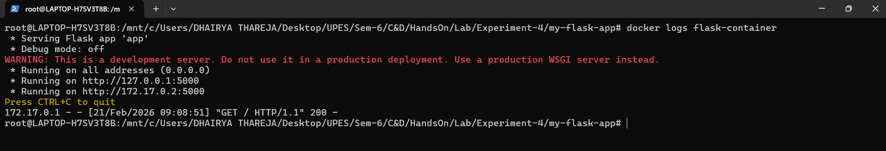


**Step-19:- Stop container**
```bash
docker stop flask-container
```
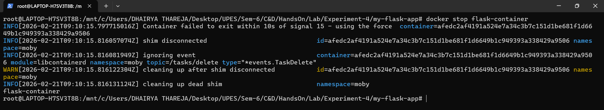


**Step-20:- Start stopped container**
```bash
docker start flask-container
```
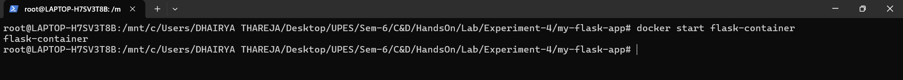


**Step-21:- Remove container**
```bash
docker rm flask-container
```
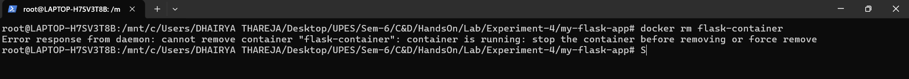


**Step-22:- Remove container forcefully** \
Since Container is in Running State, so we will remove it forcefully...
```bash
docker rm -f flask-container
```


### Multi-stage Builds

**Why Multi-stage Builds?**
- Smaller final image size
- Better security (remove build tools)
- Separate build and runtime environments

**Step-23: Create a Simple **`Dockerfile.multistage`:****
```dockerfile
# STAGE 1: Builder stage
FROM python:3.9-slim AS builder

WORKDIR /app

# Copy requirements
COPY requirements.txt .

# Install dependencies in virtual environment
RUN python -m venv /opt/venv
ENV PATH="/opt/venv/bin:$PATH"
RUN pip install --no-cache-dir -r requirements.txt

# STAGE 2: Runtime stage
FROM python:3.9-slim

WORKDIR /app

# Copy virtual environment from builder
COPY --from=builder /opt/venv /opt/venv
ENV PATH="/opt/venv/bin:$PATH"

# Copy application code
COPY app.py .

# Create non-root user
RUN useradd -m -u 1000 appuser
USER appuser

# Expose port
EXPOSE 5000

# Run application
CMD ["python", "app.py"]
```


**Step-24:- Build regular image**
```bash
docker build -t flask-regular .
```


**Step-25:- Build multi-stage image**
```bash
docker build -f Dockerfile.multistage -t flask-multistage .
```
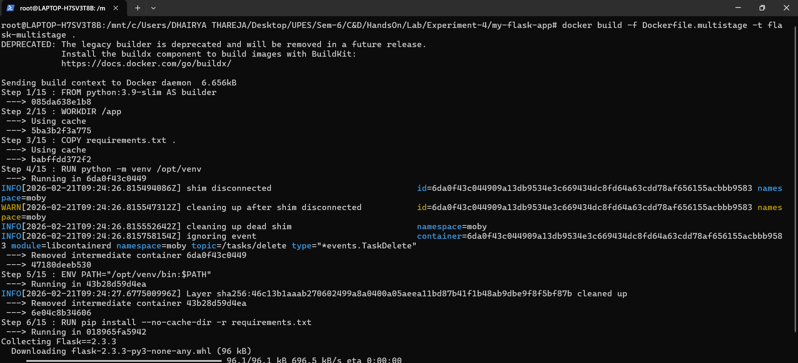


**Step-26:- Compare sizes**
```bash
docker images | grep flask-
```
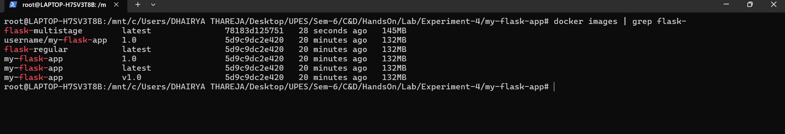


### Publishing to Docker Hub

**Step-27:- Login to Docker Hub**
```bash
docker login
```
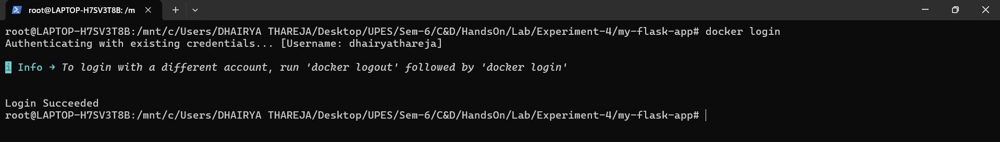


**Step-28:- Tag image for Docker Hub**
```bash
docker tag my-flask-app:latest username/my-flask-app:1.0
docker tag my-flask-app:latest username/my-flask-app:latest
```
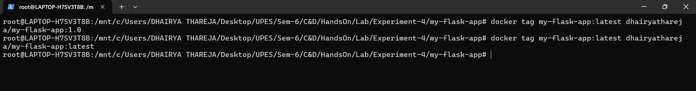


**Step-29:-  Push to Docker Hub**
```bash
docker push username/my-flask-app:1.0
```
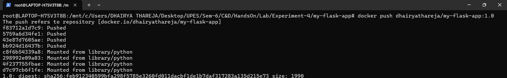

**Step-30:- Push Latest Image**
```bash
docker push username/my-flask-app:latest
```
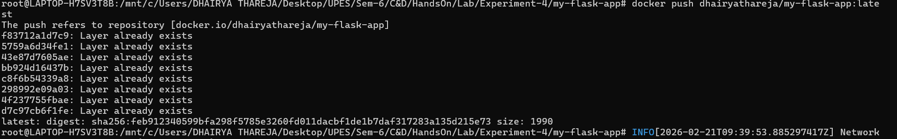


**Step-31:- Pull from Docker Hub (on another machine)**
```bash
docker pull username/my-flask-app:latest
```


**Step-32:- Run the pulled image**
```bash
docker run -d -p 5000:5000 username/my-flask-app:latest
```
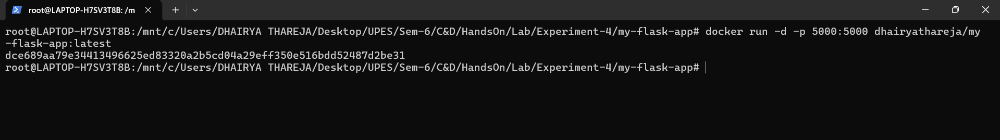


### Node.js Application Example (Quick Version)**

**Step-33:- Create a directory Node.js Application**
```bash
mkdir my-node-app
cd my-node-app
```
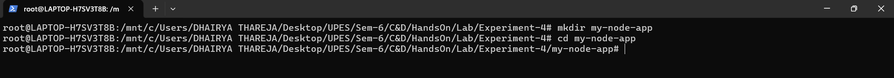


**Step-34:- Create a **`app.js`:****
```javascript
const express = require('express');
const app = express();
const port = 3000;

app.get('/', (req, res) => {
    res.send('Hello from Node.js Docker!');
});

app.get('/health', (req, res) => {
    res.json({ status: 'healthy' });
});

app.listen(port, () => {
    console.log(`Server running on port ${port}`);
});
```
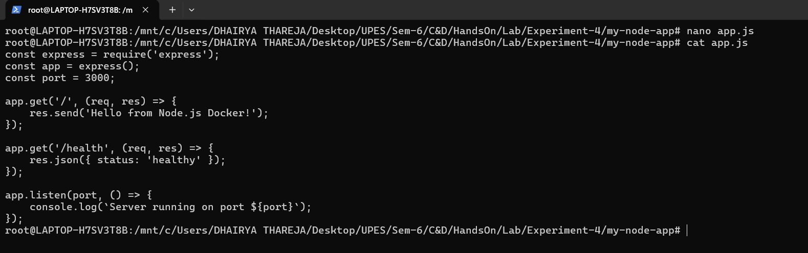


**Step-35:- Create a **`package.json`:****
```json
{
  "name": "node-docker-app",
  "version": "1.0.0",
  "main": "app.js",
  "dependencies": {
    "express": "^4.18.2"
  }
}
```
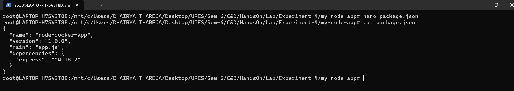


**Step-36:- Create a Node.js Dockerfile**
```dockerfile
FROM node:18-alpine

WORKDIR /app

COPY package*.json ./
RUN npm install --only=production

COPY app.js .

EXPOSE 3000

CMD ["node", "app.js"]
```
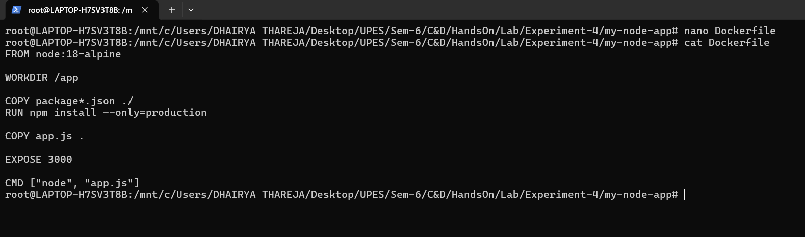


**Step-37:- Build image**
```bash
docker build -t my-node-app .
```


**Step-38:- Run container**
```bash
docker run -d -p 3000:3000 --name node-container my-node-app
```
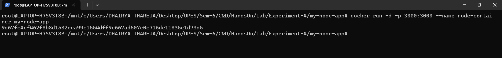


**Step-39:- Test on Terminal**
```bash
curl http://localhost:3000
```
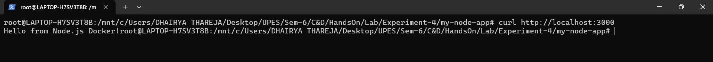


**Step-40:- Test on Browser**
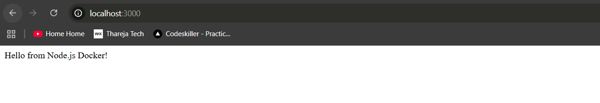


<hr>

<h4 align="center"> DockerHub </h4>

View Pushed Image on [DockerHub](https://hub.docker.com/repositories/dhairyathareja)

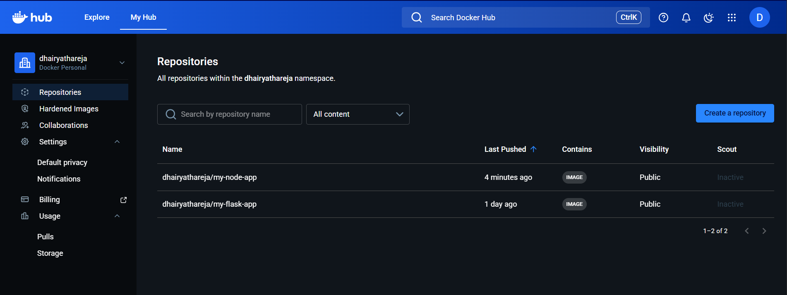

<hr>


<h4 align="center"> Conclusion </h4>

<hr>


## **Essential Docker Commands Cheatsheet**

| Command | Purpose | Example |
|---------|---------|---------|
| `docker build` | Build image | `docker build -t myapp .` |
| `docker run` | Run container | `docker run -p 3000:3000 myapp` |
| `docker ps` | List containers | `docker ps -a` |
| `docker images` | List images | `docker images` |
| `docker tag` | Tag image | `docker tag myapp:latest myapp:v1` |
| `docker login` | Login to Dockerhub using username and password or token | `echo "token" | docker login -u username --password-stdin` |
| `docker push` | Push to registry | `docker push username/myapp` |
| `docker pull` | Pull from registry | `docker pull username/myapp` |
| `docker rm` | Remove container | `docker rm container-name` |
| `docker rmi` | Remove image | `docker rmi image-name` |
| `docker logs` | View logs | `docker logs container-name` |
| `docker exec` | Execute command | `docker exec -it container-name bash` |


## **Common Workflow Summary**

### **Development Workflow:**
```bash
# 1. Create Dockerfile and .dockerignore
# 2. Build image
docker build -t myapp .

# 3. Test locally
docker run -p 8080:8080 myapp

# 4. Tag for production
docker tag myapp:latest myapp:v1.0

# 5. Push to registry
docker push myapp:v1.0
```

### **Production Workflow:**
```bash
# 1. Pull from registry
docker pull myapp:v1.0

# 2. Run in production
docker run -d -p 80:8080 --name prod-app myapp:v1.0

# 3. Monitor
docker logs -f prod-app
```

---

## **Key Takeaways**

1. **Dockerfile** defines how to build your image
2. **.dockerignore** excludes unnecessary files (important for security and performance)
3. **Tagging** helps version and organize images
4. **Multi-stage builds** create smaller, more secure production images
5. **Docker Hub** allows sharing and distributing images
6. **Always test** images locally before publishing

---

## **Cleanup**
```bash
# Remove all stopped containers
docker container prune

# Remove unused images
docker image prune

# Remove everything unused
docker system prune -a
```

<hr>

<p align="center">

⬅️ **[Previous](../Experiment-3/Readme.md)** • 🏠︎ **[Home](../../Lab/Readme.md)** 

<!-- • **[Next](../Experiment-5/Readme.md)** ➡️ -->

</p>