## Experiment 6: Comparison of Docker Run and Docker Compose

<hr>

<h4 align="center"> Introduction </h4>

<hr>

#### **Docker Run (Imperative Approach)**

The `docker run` command is used to create and start a container from an image. It requires explicit flags for:

* Port mapping (`-p`)
* Volume mounting (`-v`)
* Environment variables (`-e`)
* Network configuration (`--network`)
* Restart policies (`--restart`)
* Resource limits (`--memory`, `--cpus`)
* Container name (`--name`)

> This approach is **imperative**, meaning you specify step-by-step instructions.


#### **Docker Compose (Declarative Approach)**

Docker Compose uses a YAML file (`docker-compose.yml`) to define services, networks, and volumes in a structured format.

Instead of multiple `docker run` commands, a single command is used:

```bash
docker compose up -d
```

> Compose is **declarative**, meaning you define the desired state of the application.


**Mapping: Docker Run vs Docker Compose**

| Docker Run Flag     | Docker Compose Equivalent        |
| ------------------- | -------------------------------- |
| `-p 8080:80`        | `ports:`                         |
| `-v host:container` | `volumes:`                       |
| `-e KEY=value`      | `environment:`                   |
| `--name`            | `container_name:`                |
| `--network`         | `networks:`                      |
| `--restart`         | `restart:`                       |
| `--memory`          | `deploy.resources.limits.memory` |
| `--cpus`            | `deploy.resources.limits.cpus`   |
| `-d`                | `docker compose up -d`           |


**Advantages of Docker Compose**

1. Simplifies multi-container applications
2. Provides reproducibility
3. Version controllable configuration
4. Unified lifecycle management
5. Supports service scaling


<hr>

<h4 align="center"> Hands-On </h4>

<hr>


**Step-1:- Run nginx Container**
```bash
docker run -d \
--name lab-nginx \
-p 8081:80 \
-v $(pwd)/html:/usr/share/nginx/html \
nginx:alpine

docker ps
```
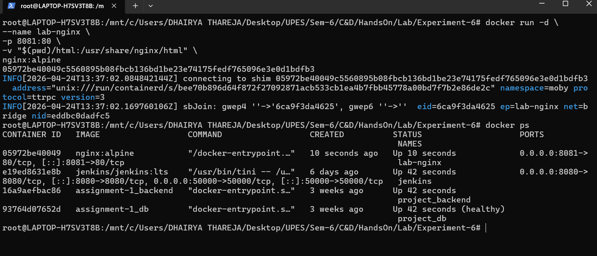


**Step-2:- Create a file `index.html` mounting on a conatiner**
```bash
nano html/index.html
cat html/index.html
docker stop lab-nginx
docker rm lab-nginx
docker run -d \
--name lab-nginx \
-p 8081:80 \
-v $(pwd)/html:/usr/share/nginx/html \
nginx:alpine
```

`index.html`:- 
```html
<h1>Experiment 6 Working</h1>
<p>Nginx is running successfully</p>
```

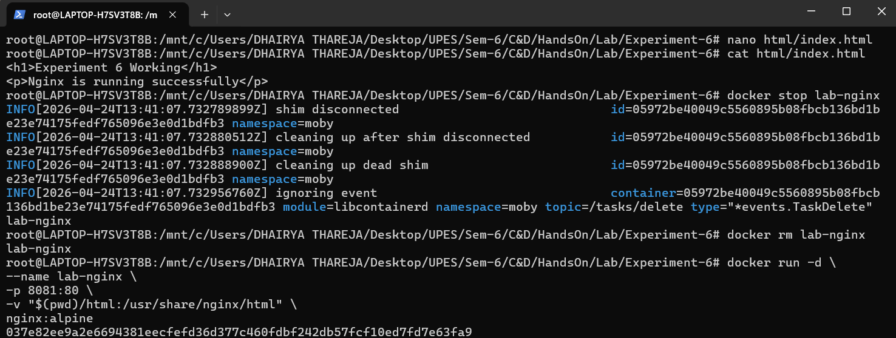


**Step-3:- View Page on Browser**
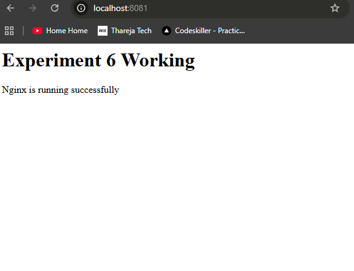


**Step-4:- Create same via compose**
```bash
nano docker-compose.yml
cat docker-compose.yml
```

`docker-compose.yml`:-
```bash
version: '3.8'

services:
  nginx:
    image: nginx:alpine
    container_name: lab-nginx
    ports:
      - "8081:80"
    volumes:
      - ./html:/usr/share/nginx/html

```
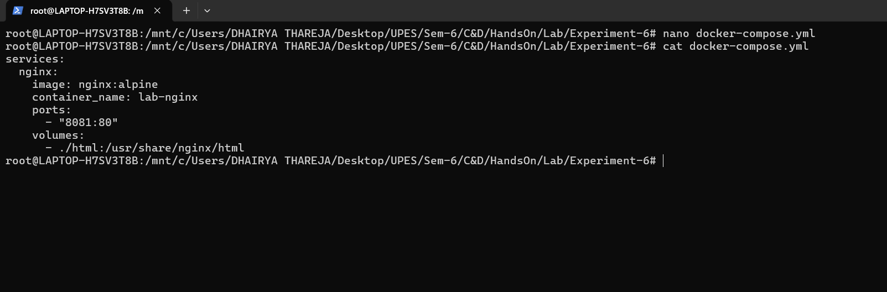


**Step-5:- Create Containers via Compose**
```bash
docker-compose up -d
docker-compose ps
```
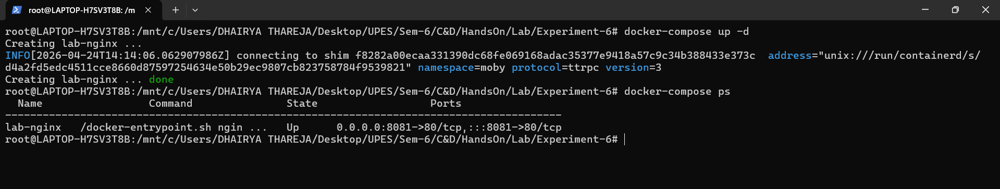


**Step-6:- Delete Compose Services**
```bash
docker-compose down
```
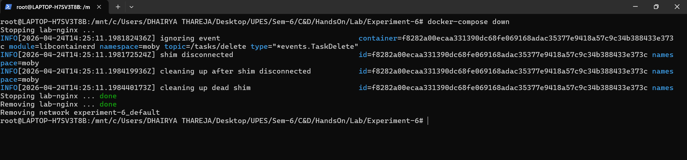


**Step-7:- Create Network**
```bash
docker network create wp-net
```
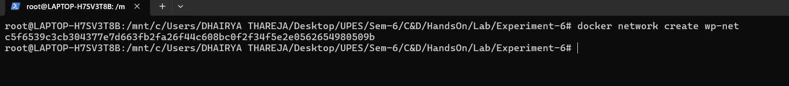


**Step-8:- Run `mysql` container**
```bash
docker run -d \
--name mysql \
--network wp-net \
-e MYSQL_ROOT_PASSWORD=secret \
-e MYSQL_DATABASE=wordpress \
mysql:5.7
```
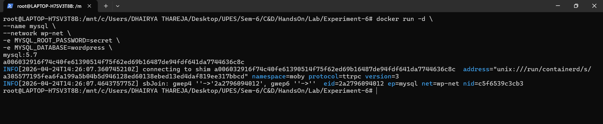


**Step-9:- Run `wordpress` container**
```bash
docker run -d \
--name wordpress \
--network wp-net \
-p 8082:80 \
-e WORDPRESS_DB_HOST=mysql \
-e WORDPRESS_DB_USER=root \
-e WORDPRESS_DB_PASSWORD=secret \
-e WORDPRESS_DB_NAME=wordpress \
wordpress:latest
```
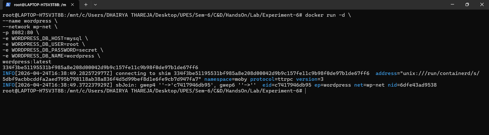


**Step-10:- Verify Page on Browser**
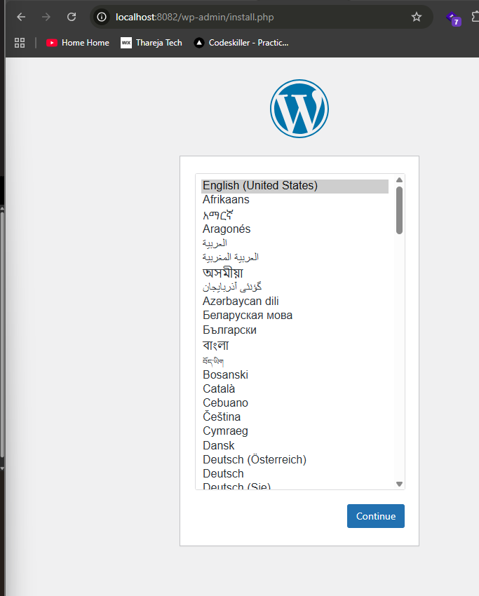


**Step-11:- `Wordpress` & `MySql` via compose**
```bash
mkdir wp-compose
cd wp-compose
nano docker-compose.yml
cat docker-compose.yml
```
```docker-compose
services:
  mysql:
    image: mysql:5.7
    container_name: mysql
    restart: always
    environment:
      MYSQL_ROOT_PASSWORD: secret
      MYSQL_DATABASE: wordpress
      MYSQL_USER: wpuser
      MYSQL_PASSWORD: secret
    volumes:
      - mysql_data:/var/lib/mysql

  wordpress:
    image: wordpress:latest
    container_name: wordpress
    restart: always
    ports:
      - "8082:80"
    environment:
      WORDPRESS_DB_HOST: mysql
      WORDPRESS_DB_USER: wpuser
      WORDPRESS_DB_PASSWORD: secret
    depends_on:
      - mysql

volumes:
  mysql_data:
```
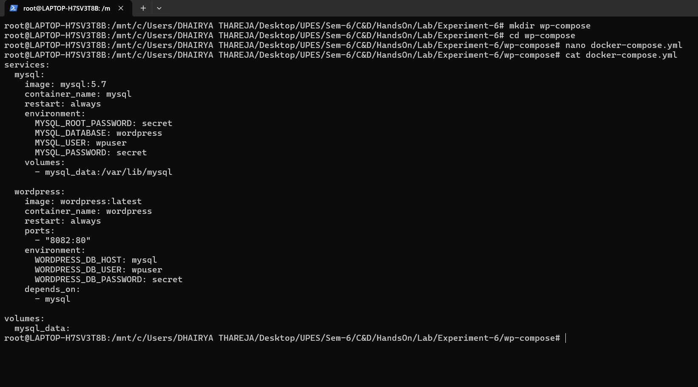


**Step-12:- Start Services**
```bash
docker-compose up -d
docker-compose ps
```
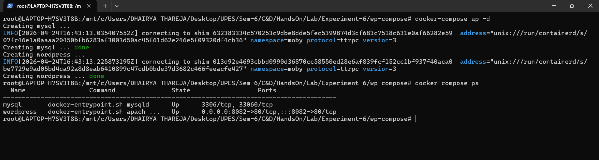


**Step-13:- View On Browser**
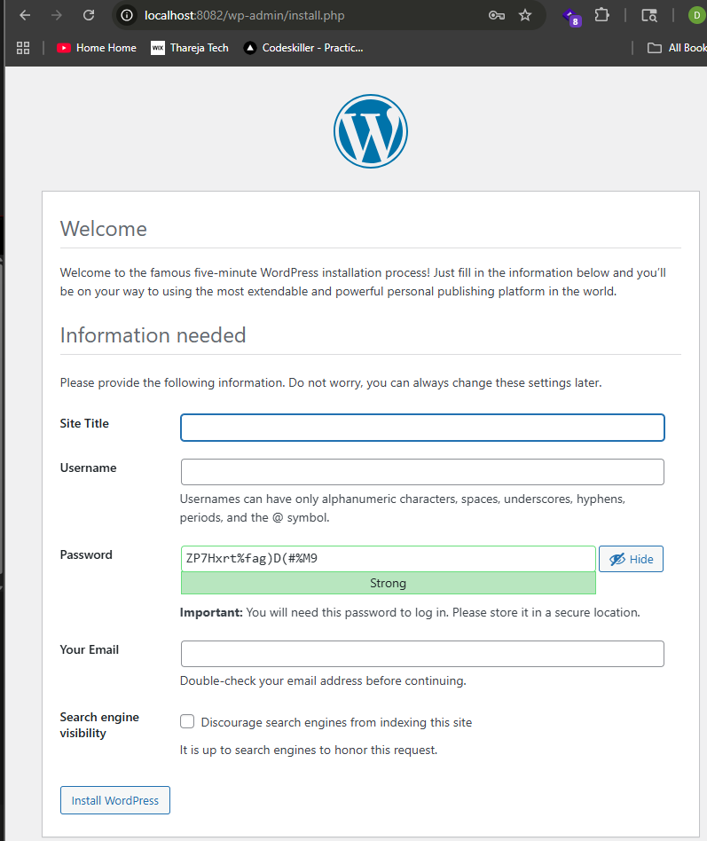


**Step-14:- Create container with Node Image**
```bash
docker run -d \
--name webapp \
-p 5000:5000 \
-e APP_ENV=production \
-e DEBUG=false \
--restart unless-stopped \
node:18-alpine
```
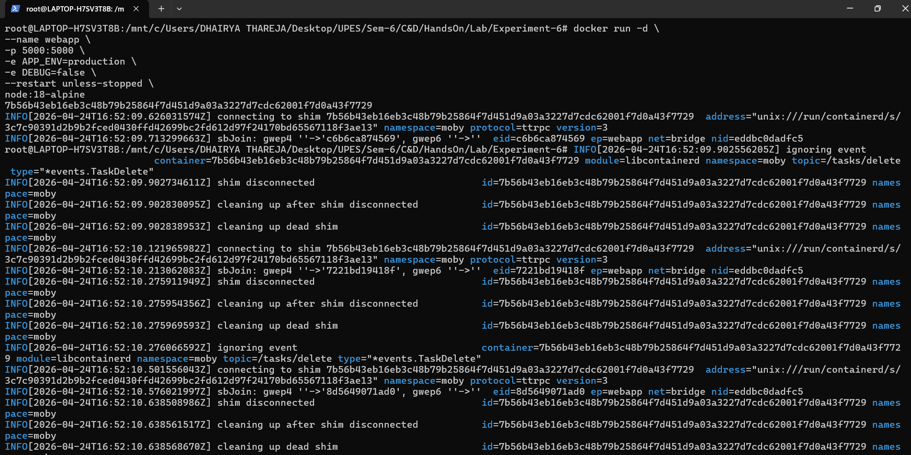


**Step-15:- Create Node container via Compose**
```bash
mkdir task3-webapp
cd task3-webapp
nano docker-compose.yml
cat docker-compose.yml
```

`docker-compose.yml`:-
```bash
services:
  webapp:
    image: node:18-alpine
    container_name: webapp
    ports:
      - "5000:5000"
    environment:
      APP_ENV: production
      DEBUG: "false"
    restart: unless-stopped
```
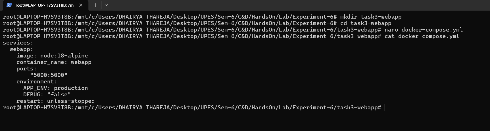


**Step-16:- Start Services**
```bash
docker-compose up -d
docker-compose ps
```
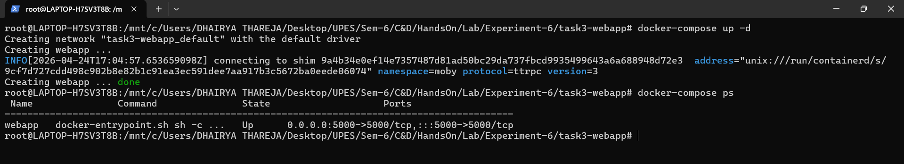


**Step-17:- Veridy On Browser**


**Step-18:- Stop Services**
```bash
docker-compose down
```
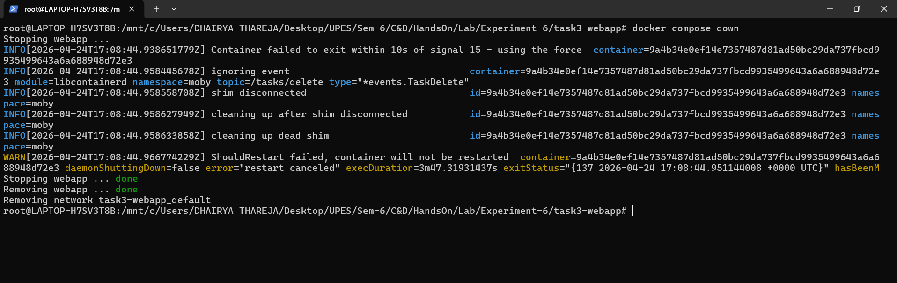


**Step-19:- Create Network**
```bash
docker network create app-net
```
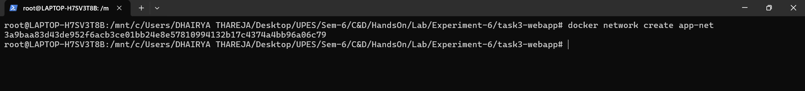


**Step-20:- Create `Python` & `Postgres` Conatiners via Terminal**
```bash
docker run -d \
--name postgres-db \
--network app-net \
-e POSTGRES_USER=admin \
-e POSTGRES_PASSWORD=secret \
-v pgdata:/var/lib/postgresql/data \
postgres:15

docker run -d \
--name backend \
--network app-net \
-p 8000:8000 \
-e DB_HOST=postgres-db \
-e DB_USER=admin \
-e DB_PASS=secret \
python:3.11-slim
```
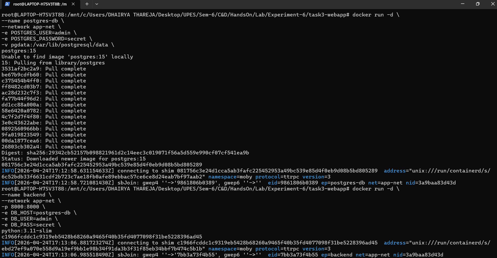


**Step-21:- List Containers**
```bash
docker ps
```
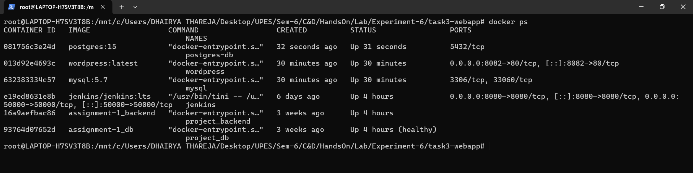


**Step-22:- List Networks**
```bash
docker network ls
```
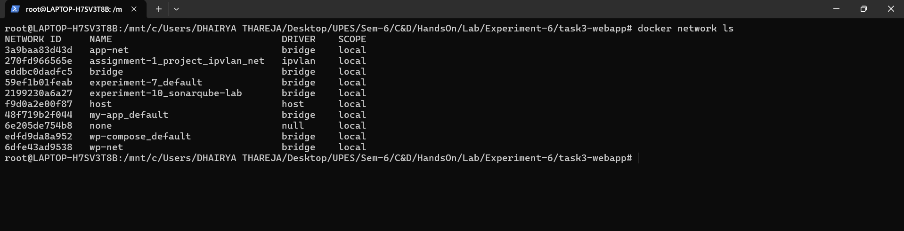


**Step-23:- List Volumes**
```bash
docker volumes ls 
```
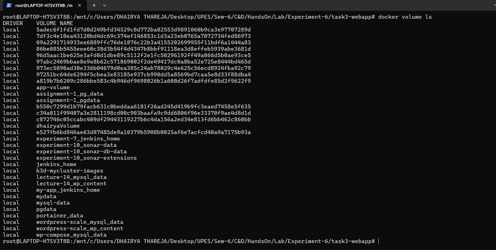


**Step-24:- Stop Containers & Remove Network**
```bash
docker stop backend postgres-db
docker rm backend postgres-db
docker network rm app-net
```
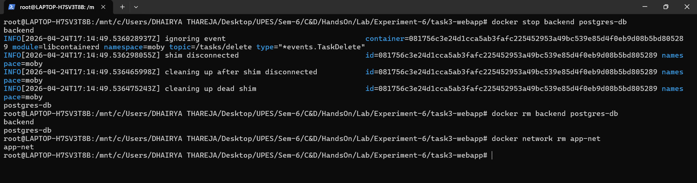

**Step-25:- Create same services via Compose**
```bash
nano docker-compose.yml
cat docker-compose.yml
```

`docker-compose.yml`:-
```bash
services:
  postgres-db:
    image: postgres:15
    container_name: postgres-db
    environment:
      POSTGRES_USER: admin
      POSTGRES_PASSWORD: secret
    volumes:
      - pgdata:/var/lib/postgresql/data
    networks:
      - app-net

  backend:
    image: python:3.11-slim
    container_name: backend
    ports:
      - "8000:8000"
    environment:
      DB_HOST: postgres-db
      DB_USER: admin
      DB_PASS: secret
    depends_on:
      - postgres-db
    networks:
      - app-net

volumes:
  pgdata:

networks:
  app-net:
```
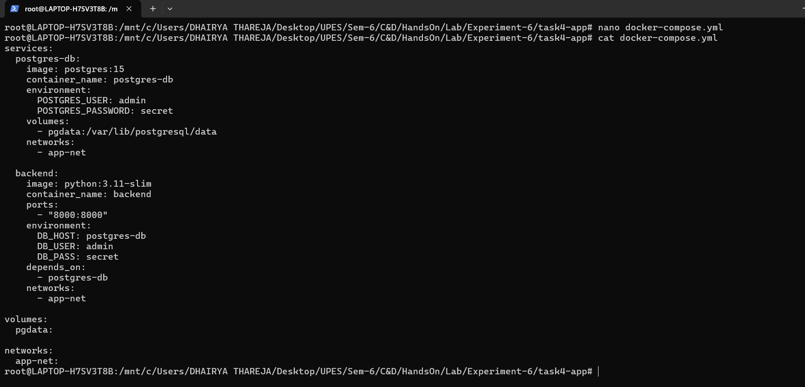


**Step-26:- Start Services**
```bash
docker-compose up -d
docker-compose ps
```
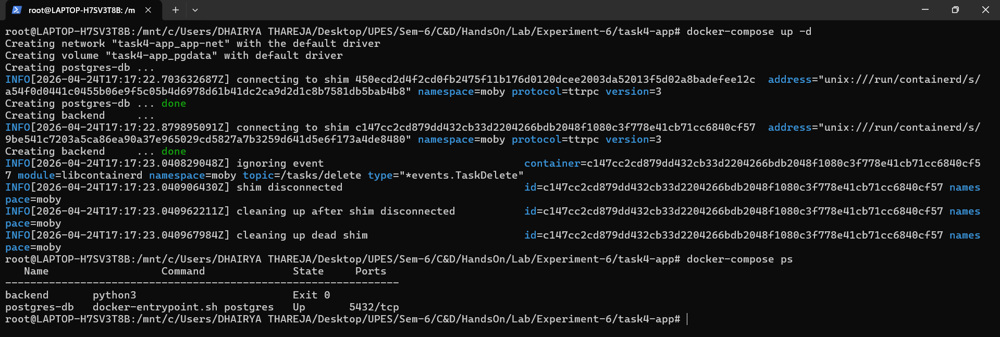


**Step-27:- List Volumes**
```bash
docker volume ls
```
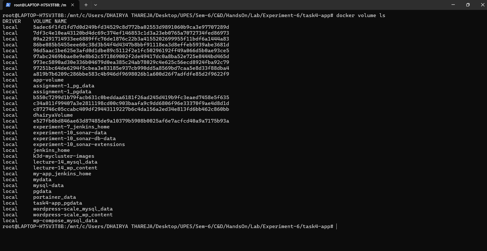


**Step-28:- Stop Services**
```bash
docker-compose down
```
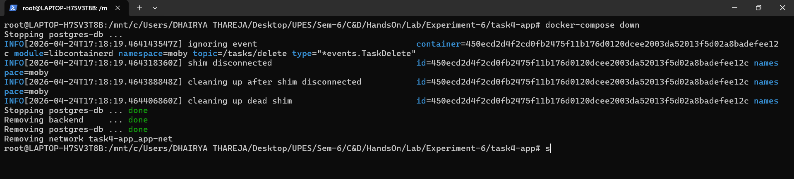


**Step-29:- Create Node app**
```bash
nano app.js
cat app.js
```

`app.js`:-
```js
const http = require('http');

http.createServer((req, res) => {
  res.end("Docker Compose Build Lab");
}).listen(3000);
```
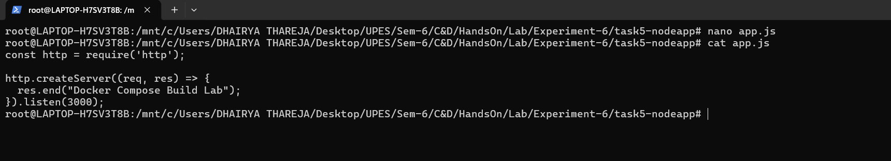


**Step-30:- Create Dockerfile**
```bash
nano Dockerfile
cat Dockerfile
```

`Dockerfile`:-
```dockerfile
FROM node:18-alpine

WORKDIR /app

COPY app.js .

EXPOSE 3000

CMD ["node", "app.js"]
```
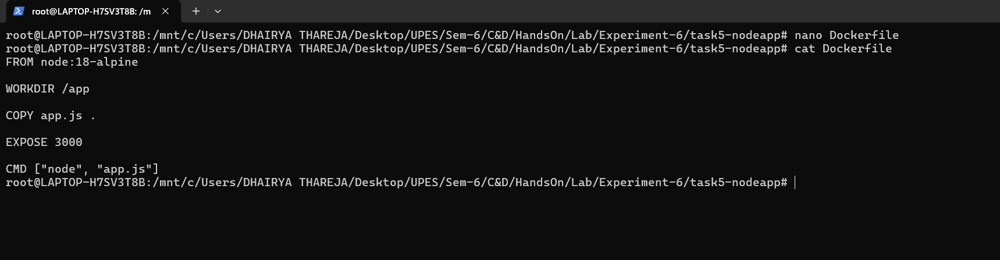


**Step-31:- Create Compose File**
```bash
nano docker-compose.yml
cat docker-compose.yml
```

`docker-compose.yml`:-
```bash
services:
  nodeapp:
    build:
      context: .
      dockerfile: Dockerfile
    container_name: custom-node-app
    ports:
      - "3000:3000"
```
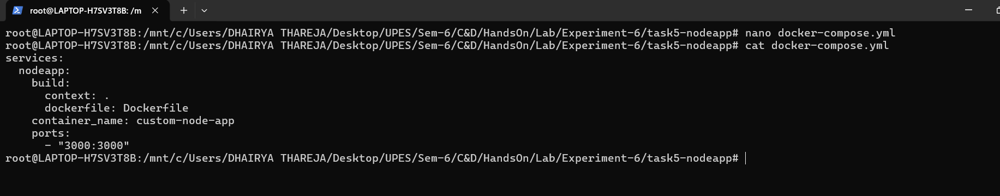


**Step-32:- Start Compose Services**
```bash
docker-compose up --build -d
docker-compose ps
```
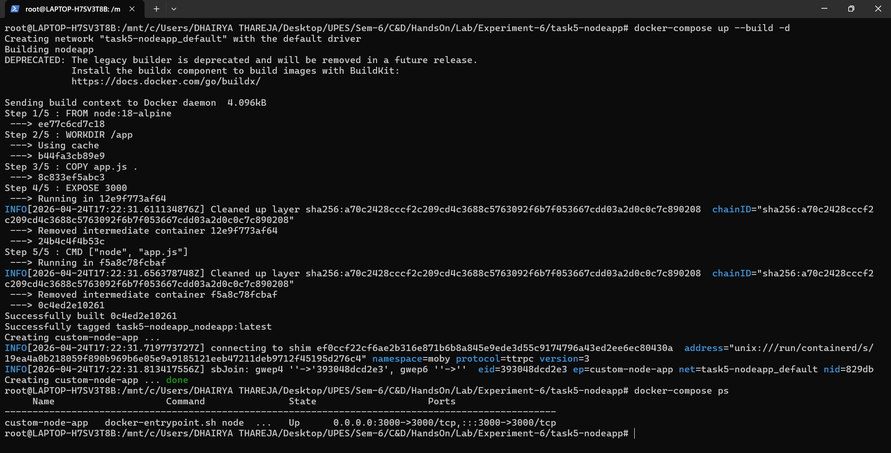


**Step-33:- Verify on Browser**
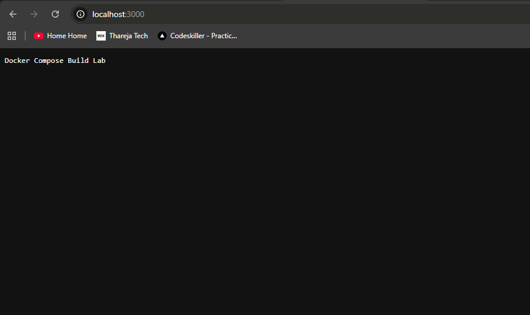


<hr>

<h4 align="center"> Conclusion </h4>

<hr>

This experiment demonstrated:

- How to deploy **WordPress + MySQL** using Docker Compose.
- How containers communicate using internal networking.
- Importance of **volumes for persistence**.


<hr>

<div align="center">

<a href="../Experiment-5/" class="btn btn-outline">⬅️ Previous</a>
&nbsp;&nbsp;
<a href="../" class="btn">🏠︎ Home</a>
&nbsp;&nbsp;
<a href="../Experiment-7/" class="btn btn-primary">Next ➡️</a>

</div>