## Experiment 7:  CI/CD using Jenkins, GitHub and Docker Hub
<hr>

<h4 align="center"> Introduction </h4>

<hr>

#### **What is Jenkins?**
Jenkins is a **web-based GUI automation server** used to:

- Build applications
- Test code
- Deploy software

It provides:

- Dashboard (browser-based UI)
- Plugin ecosystem (GitHub, Docker, etc.)
- Pipeline as Code using `Jenkinsfile`


#### **What is CI/CD ??**

- **Continuous Integration (CI):** Code is automatically built and tested after each commit

- **Continuous Deployment (CD):** Built artifacts (Docker images) are automatically delivered/deployed


#### **Workflow Overview**
```
Developer → GitHub → Webhook → Jenkins → Build → Docker Hub
```


#### **Prerequisites**

**Create a repository on GitHub:**
```
[my-app](https://github.com/dhairyathareja/my-app.git)
```

**Project Structure**

```id="w6t8l9"
my-app/
├── app.py
├── requirements.txt
├── Dockerfile
├── Jenkinsfile
```


<hr>

<h4 align="center"> Hands-On </h4>

<hr>


**Step-1:- Create a `app.py`**
```bash
nano app.py
```
Paste This:
```python
from flask import Flask
app = Flask(__name__)

@app.route("/")
def home():
    # return "Hello from CI/CD Pipeline!"
    return "Hello from CI/CD Pipeline!, my sapid is 500118984"

app.run(host="0.0.0.0", port=80)

```
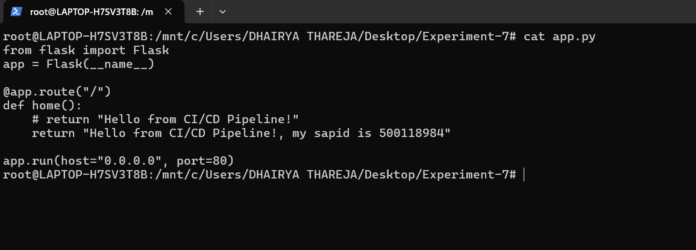


**Step-2:- Create `requirements.txt`**
```bash
nano requirements.txt
```
Paste this:
```
flask
```
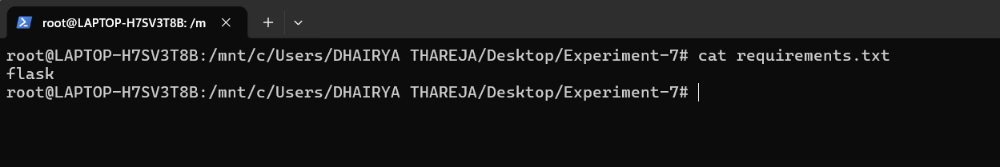


**Step-3:- Create `Dockerfile`**
```bash
nano Dockerfile
```
Paste this:
```Dockerfile
FROM python:3.10-slim

WORKDIR /app
COPY . .

RUN pip install -r requirements.txt

EXPOSE 80
CMD ["python", "app.py"]

```
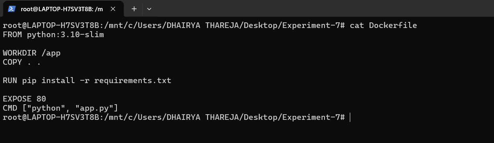


**Step-4:- Create `Jenkinsfile`**
```bash
nano Jenkinsfile
```
Paste this:
```Jenkinsfile
pipeline {
    agent any

    environment {
        IMAGE_NAME = "dhairyathareja/myapp"
    }

    stages {


        stage('Build Docker Image') {
            steps {
                s++h 'docker build -t $IMAGE_NAME:latest .'
            }
        }

        stage('Login to Docker Hub') {
            steps {
                withCredentials([string(credentialsId: 'dockerhub-token', variable: 'DOCKER_TOKEN')]) {
                    sh 'echo $DOCKER_TOKEN | docker login -u dhairyathareja --password-stdin'
                }
            }
        }

        stage('Push to Docker Hub') { 
            steps {
                sh 'docker push $IMAGE_NAME:latest'
            }
        }
    }
}

```
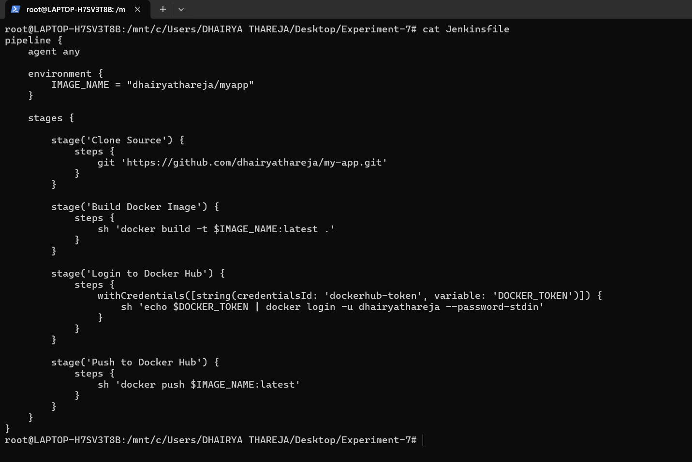


**Step-5:- Create `docker-compose.yml`**
```docker-compose
version: '3.8'

services:
  jenkins:
    image: jenkins/jenkins:lts
    container_name: jenkins
    restart: always
    ports:
      - "8080:8080"
      - "50000:50000"
    volumes:
      - jenkins_home:/var/jenkins_home
      - /var/run/docker.sock:/var/run/docker.sock
    user: root

volumes:
  jenkins_home:

```
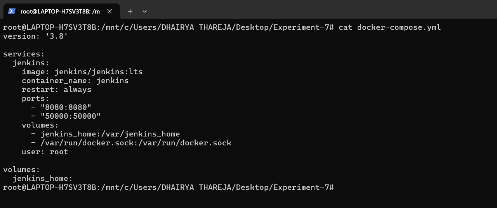


**Step-6:- Start Up Compose**
```bash
docker-compose up -d
```
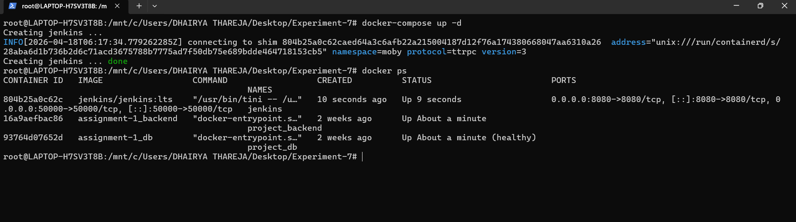


**Step-7:- Exec Jenkins Contrainer to get Password**
```bash
docker exec -it jenkins cat /var/jenkins_home/secrets/initialAdminPassword
```
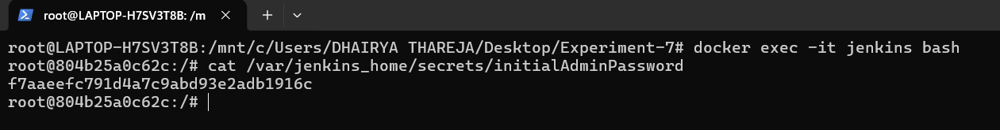


**Step-8:- Login to Jenkins Dashboard on Browser**
```bash
http://localhost:8080
```
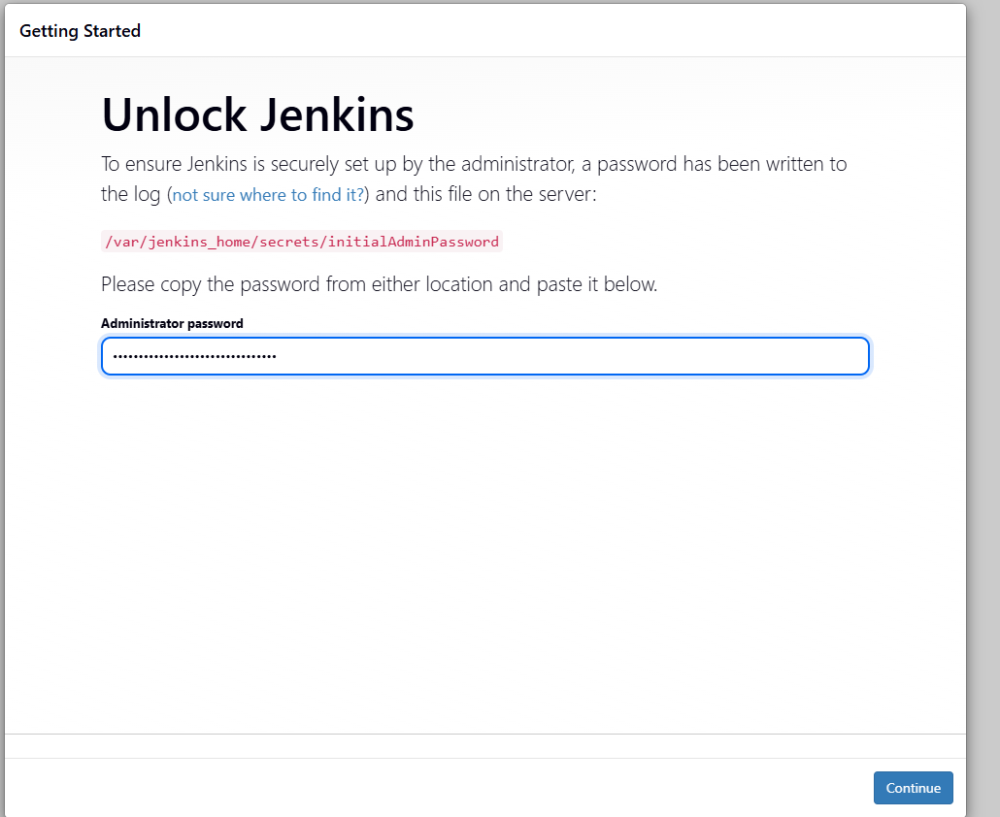


**Step-9:- Install Sugeested Plugins**

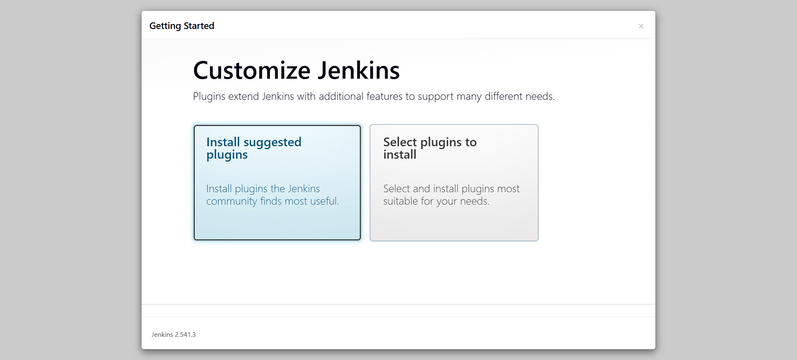


**Step-10:- Plugins List**
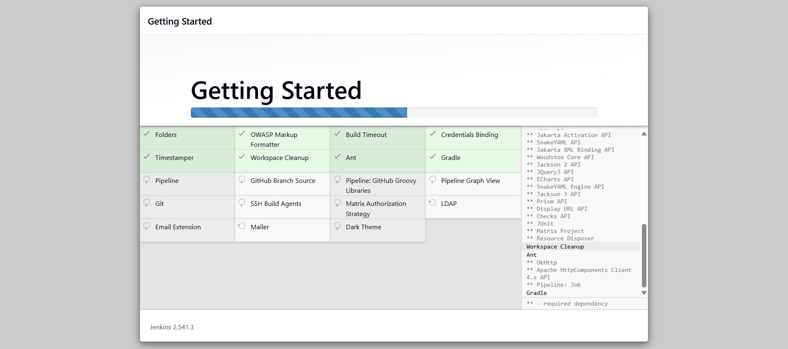


**Step-11:- Create Admin User**
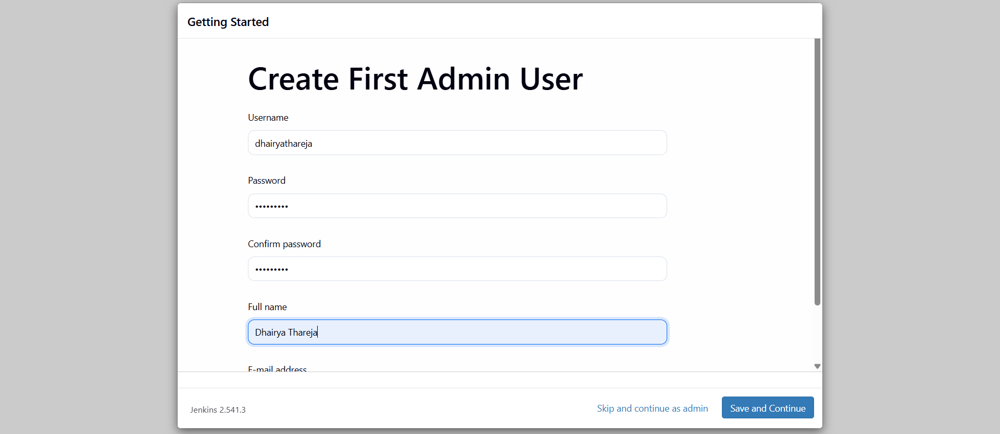


**Step-12:- Admin Dashboard Interface**
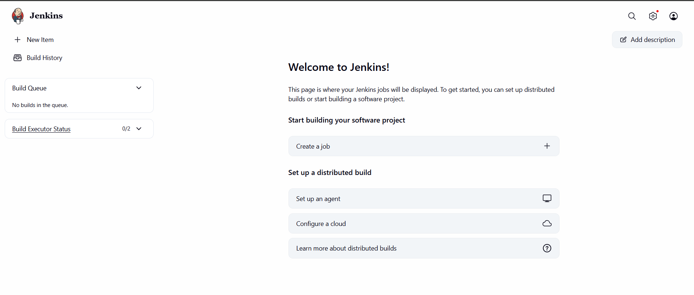


**Step-13:- Add `DockerHub Token` in Credentials**
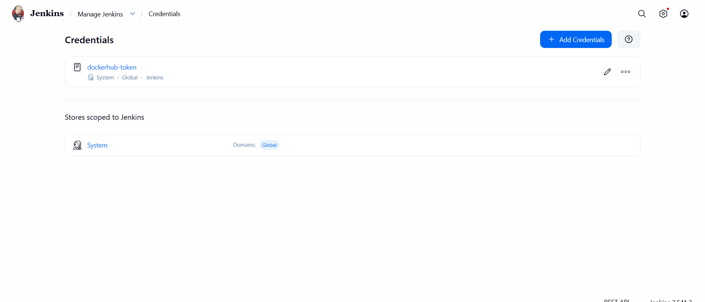


**Step-14:- Create a Repository in Dockerhub**
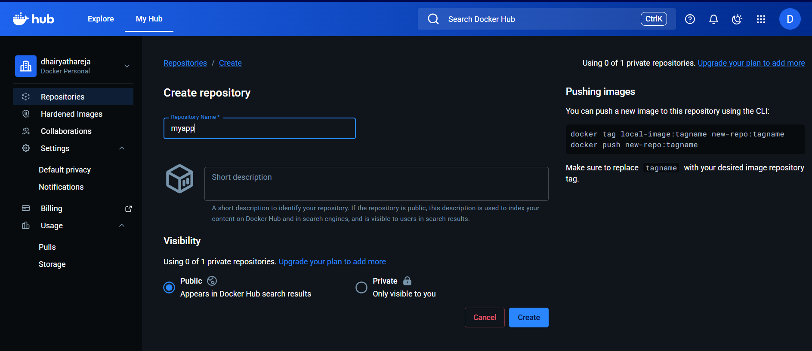


**Step-15:- Repository will be listed**
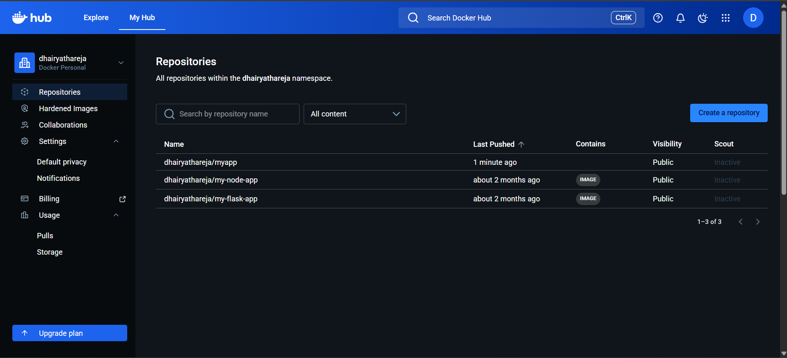


**Step-16:- Create Pipeline Job**
- New-Item:- Pipeline
- Name:- `ci-cd-pipeline`
- Definition:- Pipleine Script from SCM
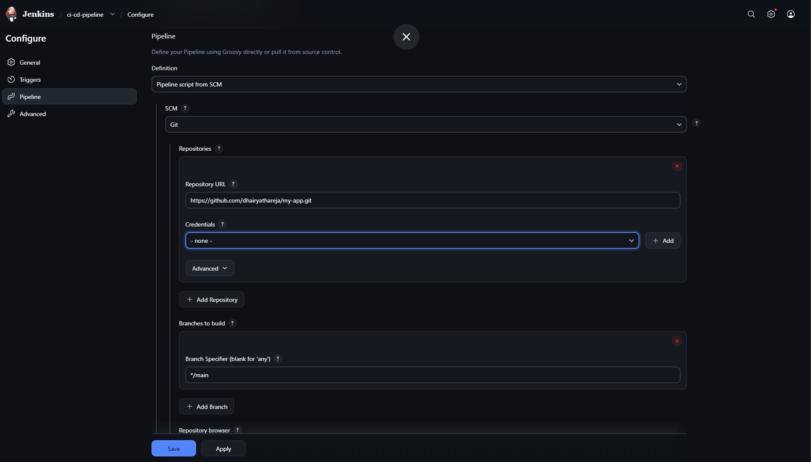


**Step-17:- Build Pipeline & Track Stages in Console Output**
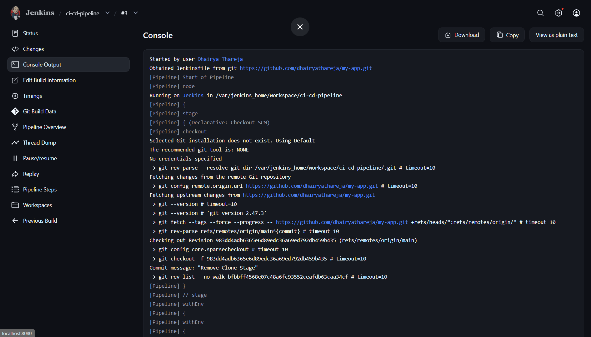


**Step-18:- Build Status Success will be shown with Green Tick**
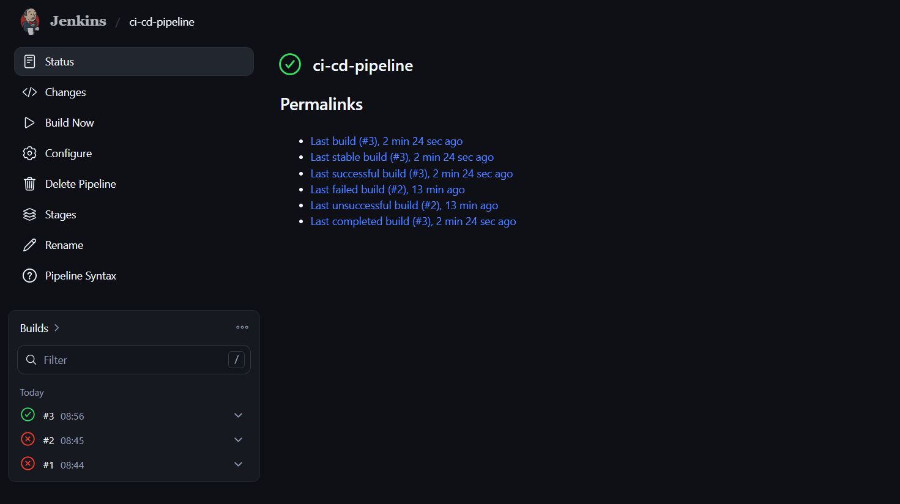


**Step-19:- Repo will be consisting Image Now !!!**
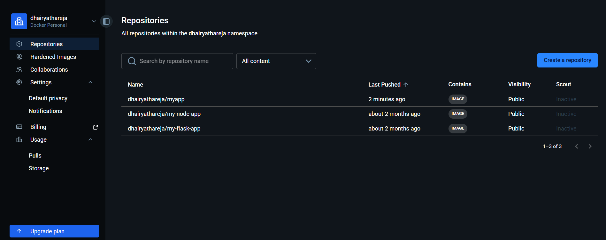


<hr>

<div align="center">

<a href="../Experiment-6/" class="btn btn-outline">⬅️ Previous</a>
&nbsp;&nbsp;
<a href="../" class="btn">🏠︎ Home</a>
&nbsp;&nbsp;
<a href="../Experiment-9/" class="btn btn-primary">Next ➡️</a>

</div>